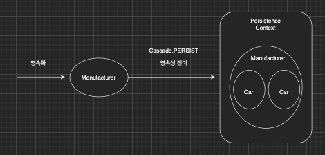

이번 장에서는 JPA의 영속성 전이(Cascade)에 대해서 알아본다.
글의 하단부에 참고한 강의와 공식문서의 경로를 첨부하였으므로 자세한 사항은 강의나 공식문서에서 확인한다.

---

### 영속성 전이(Cascade)

특정 엔티티를 영속 상태로 만들 때 연관된 엔티티도 함께 영속 상태로 만들고 싶은 경우에 사용한다.
차량(Car)과 제조사(Manufacturer)를 예로 설명해본다.

```java
@Entity
public class Car {
    @Id
    @GeneratedValue
    private Long id;
    @ManyToOne(fetch = FetchType.LAZY)
    @JoinColumn(name = "manufacturer_id")
    private Manufacturer manufacturer;
}

@Entity
public class Manufacturer {
    @Id
    @GeneratedValue
    private Long id;
    @OneToMany(mappedBy = "manufacturer", cascade = CascadeType.PERSIST)
    private List<Car> cars = new ArrayList<>();
}
```

Entity가 위처럼 설계되어있고 제조사를 생성해서 저장하는 코드를 본다.

```java
Car carA = new Car();
Car carB = new Car();
Manufacturer manufacturerA = new Manufacturer();
manufacturerA.getCars().add(carA);
manufacturerA.getCars().add(carB);
entityManager.persist(manufacturer);
```

코드상으로 보면 제조사에 속하는 carA와 carB는 영속성 컨텍스트에 persist하는 코드가 없다.
하지만 Cascade의 속성이 PERSIST이기 때문에 제조사가 영속화될 때 carA와 carB도 같이 영속화 된다.



이러한 영속성 전이는 Entity간의 연관관계 매핑과는 무관하다.
Entity를 영속화할 때 연관된 Entity도 함께 영속화하는 편리함을 제공할 뿐이다.
영속성 전이의 종류에는 총 6가지가 있다.

- CascadeType.ALL: 모든 Cascade를 적용한다.
- CascadeType.PERSIST: 저장 시 연관된 Entity도 함께 Persist된다. 
- CascadeType.REMOVE: 삭제 시 연관된 Entity도 함께 삭제된다.
- CascadeType.MERGE: Detach된 Entity를 영속성 컨텍스트에 Merge할 때 연관된 Entity로 같이 Merge된다.
- CascadeType.DETACH: 영속성 컨텍스트에서 Detach할 때 연관된 Entity도 같이 Detach된다.

---

### 고아 객체(Orphan)

고야 객체란 부모 Entity와의 연관관계가 끊어진 자식 Entity를 말하며, 고아 객체 제거는 이러한 객체를 자동으로 삭제하는 기능을 말한다.
참고자 제거된 Entity는 다른 곳에서 참조하지 않는다는 전제하에 삭제하는 기능이다.
**만약 여러곳에서 참조를 하고 있다면 사용해서는 안된다**.
@OneToOne과 @OneToMany에서만 사용이 가능하다.

부모 객체를 제거하면 자식은 고아 객체가 되고 고아 객체 제거 기능을 사용하면 부모 객체를 제거할 때 자식도 함께 제거된다.
이러한 기능은 영속성 전이의 CascadeType.REMOVE처럼 동작한다.

만약 자식 객체가 부모 객체만이 참조하는 객체라면 CascadeType.ALL + orphanRemoval = true로 설정하여 부모와 자식의 생명주기를 동일하게 한다.
DDD에서 Aggregate Root 개념을 구현할 때 유용하다.

---

참고한 강의: https://www.inflearn.com/course/ORM-JPA-Basic

JPA 공식 문서: https://docs.spring.io/spring-data/jpa/docs/current/reference/html/#reference

위키백과: https://ko.wikipedia.org/wiki/%EC%9E%90%EB%B0%94_%ED%8D%BC%EC%8B%9C%EC%8A%A4%ED%84%B4%EC%8A%A4_API