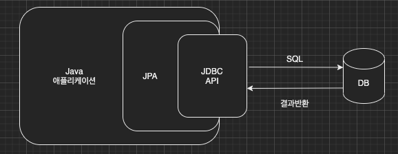
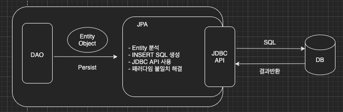
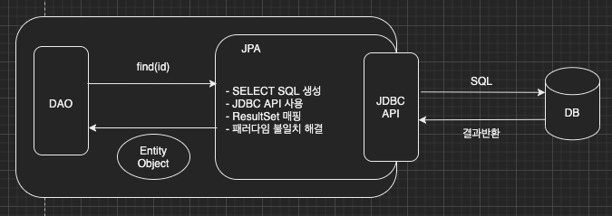

이번 장에서는 JPA (Java Persistence API)가 무엇인지 알아본다.
글의 하단부에 참고한 강의와 공식문서의 경로를 첨부하였으므로 자세한 사항은 강의나 공식문서에서 확인한다.

---

### JPA
> Java Persistence API의 약자로 자바 퍼시스턴스 API 또는 자바 지속성 API로 불린다.
> 자바 플랫폼 Standard Edition과 자바 플랫폼 Enterprise Edition을 사용하는 응용프로그램에서
> 관계형 데이터베이스의 관리를 표현하는 자바 진영의 ORM 기술 표준이다.

---

#### ORM
ORM이란 Object Relational Mapping의 약자로 객체 관계 매핑을 의미한다.
객체는 객체대로 설계하고 관계형 데이터베이스는 관계형 데이터베이스대로 설계하고 ORM 프레임워크가 중간에서 매핑시켜주는 역할을 한다.
대부분의 언어와 프레임워크에는 ORM이 존재하며 Spring에서는 Hibernate가 가장 많이 사용된다.

JPA 버전은 아래와 같다.
- JPA 1.0(JSR 220) 2006년: 초기 버전. 복합 키와 연관관계 기능이 부족하다.
- JPA 2.0(JSR 317) 2009년: 대부분의 ORM 기능을 포함하며 JPA Criteria가 추가되었다.
- JPA 2.1(JSR 338) 2013년: 스토어드 프로시저 접근이 가능하며 컨버터, 엔티티 그래프 기능이 추가되었다.

JPA는 표준 명세로 인터페이스의 모음이며 JPA 2.1 버전 표준 인터페이스를 구현한 세 가지 구현체가 있다.
Hibernate, EclipseLink, DataNucleus가 있으며 Hibernate가 대표적으로 많이 사용된다.

---

#### JPA 동작 방식

**JPA는 애플리케이션과 JDBC 사이에서 동작**

개발자가 직접 SQL문을 작성하지 않아도 JPA가 자동으로 생성하여 JDBC에게 전달하고 원하는 결과를 확인할 수 있다.



**JPA 저장**

데이터를 저장할 때 개발자는 Insert 쿼리를 작성하지 않는다.
JPA의 영속성 컨텍스트로 Entity를 Persist하면 JPA는 해당 엔티티를 분석하여
Insert 쿼리를 생성하고 생성된 쿼리를 JDBC로 전달하여 데이터를 DB에 Insert하게 된다.



**JPA 조회**

데이터를 조회하는 경우에도 개발자는 Select 쿼리를 작성하지 않는다.
데이터를 식별할 수 있는 값(일반적으로 id)으로 JPA의 find 메서드를 호출하면
JPA에 자동으로 Select 쿼리를 생성하여 원하는 데이터를 조회한다.



---

#### JPA 사용 이유

- 쿼리를 JPA가 대신 작성해주므로 SQL 중심의 개발에서 **객체 중심의 개발**이 가능해졌다.

- 단순한 기능은 Entity 클래스 생성과 동시에 만들어지기 때문에 **생산성이 높아진다**.

- 기존에 컬럼이 추가되거나 삭제되는 경우 모든 SQL이 영향을 받았다. 하지만 Entity 클래스만 수정해주면
  JPA에서 알아서 쿼리를 생성하므로 **유지보수가 용이**해졌다.

- 객체와 관계형 데이터베이스간의 **패러다임의 불일치를 해결**했다.

- JPA에서 사용하고자하는 DB에 맞는 쿼리를 자동으로 생성하므로 데이터 접근이 추상화되어 **DB 벤더사에 종속적이지 않은 개발**이 가능하다.

- 1차 캐시, 쓰기 지연, 지연 로딩을 통해 **성능이 향샹**된다.

**1차 캐시를 사용하여 동일성을 보장한다.**

1. 같은 트랜잭션 내에서는 항상 같은 엔티티를 반환한다.
2. 데이터베이스의 격리 레벨(Isolation Level)과 무관하게 Repeatable Read를 보장한다.

```java
Long userId = 1L;

User user1 = jpa.find(User.class, userId); // 쿼리 실행
User user2 = jpa.find(User.class, userId); // 캐시에서 조회(성능 향상)
```

**트랜잭션 내에서 INSERT 지연**
1. 트랜잭션이 커밋되기 전까지 INSERT 쿼리가 실행되지 않는다.
2. JDBC Batch SQL을 사용하여 한번에 SQL을 전달한다.

```java
// 트랜잭션 시작
transaction.begin(); 
        
// Entity를 영속성 컨텍스트에 persist시켰지만 INSERT 쿼리는 발생하지 않는다.
entityManager.persist(user1);
entityManager.persist(user2);
entityManager.persist(user3);

// 트랜잭션이 커밋되는 시점에 모아두었던 Insert 쿼리를 전송한다.
transaction.commit();
```

**트랜잭션 내에서 UPDATE 및 DELETE 지연**
1. UPDATE, DELETE로 인한 DB row Lock 시간을 최소화한다.
2. 트랜잭션 커밋이 발생하는 시점에 UPDATE, DELETE SQL이 실행된다.

```java
// 트랜잭션 시작
transaction.begin();

// 비지니스 로직이 수행하는 동안에는 DB row에 Lock이 걸리지 않는다.
updateUser(user1);
deleteUser(user2);

// 커밋하는 시점에서 UPDATE, DELETE SQL이 한번에 실행된다.
transaction.commit();
```

**지연 로딩과 즉시 로딩**
지연 로딩(Lazy Loading): 평소에는 마치 비어있는 프록시 객체에 데이터가 있는 것처럼 작동하다가 실제로 데이터가 필요한 시점에
DB에 SELECT 쿼리를 전송하여 필요한 시점에 객체에 데이터를 맞추는 방법.

즉시 로딩(Eager Loading): 객체를 생성하는 시점에 JOIN 쿼리를 사용하여 연관된 객체까지 미리 조회하는 방법.

---

참고한 강의: https://www.inflearn.com/course/ORM-JPA-Basic

JPA 공식 문서: https://docs.spring.io/spring-data/jpa/docs/current/reference/html/#reference

위키백과: https://ko.wikipedia.org/wiki/%EC%9E%90%EB%B0%94_%ED%8D%BC%EC%8B%9C%EC%8A%A4%ED%84%B4%EC%8A%A4_API