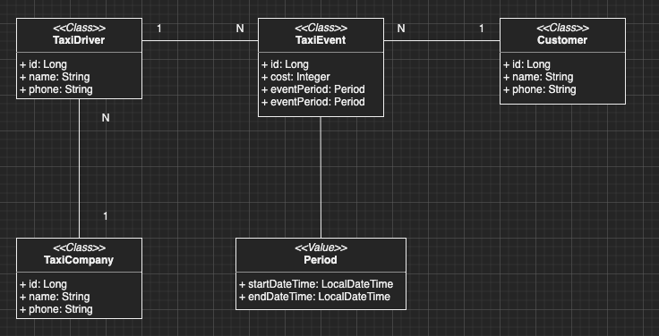
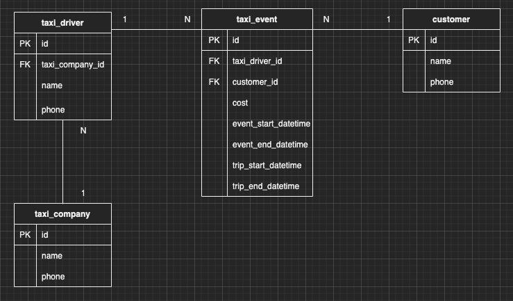

이번 장에서는 객체지향 쿼리 언어인 JPQL에 대해서 알아본다.
글의 하단부에 참고한 강의와 공식문서의 경로를 첨부하였으므로 자세한 사항은 강의나 공식문서에서 확인한다.

### 객체 지향 쿼리 언어

예를 들기위한 클래스와 테이블 구조는 아래와 같다.

**Class**

- TaxiCompany: 택시 회사를 의미하며 여러 택시 기사를 보유하고 있다.
- TaxiDriver: 택시 기사를 의미하며 특정 택시 회사에 속해있다.
- TaxiEvent: 택시 기사가 고객을 태우는 하나의 이벤트를 의미한다.
- Customer: 택시에 승차하는 고객.
- Period: 기간을 나타내는 값 타입.



**Table**



JPA는 다양한 쿼리 방법을 지원하며 JPQL, QueryDSL이 있다.
이번 장에서는 JPQL에 대해서만 다루고 QueryDSL은 추후의 강의를 듣고 따로 학습하도록 한다.

---

### JPQL(Java Persistence Query Language)

JPQL은 객체지향 쿼리이므로 테이블을 대상으로 쿼리를 작성하는 것이 아니라 엔티티를 대상으로 쿼리를 작성한다.
(다만 쿼리의 형태는 비슷하다.)
JPQL은 특정한 경우(NativeQuery 사용, Function을 등록하고 사용)를 제외하고는 쿼리를 추상화하여 특정 데이터베이스에 의존하지 않고
사용자가 작성한 JPQL을 사용자의 환경에 맞는 SQL로 변경해준다.

#### 문법

Entity와 속성은 대소문자를 구분하며 JPQL의 키워드는 대소문자를 구분하지 않는다.
또한 JPQL을 작성할 때 테이블의 이름이 아닌 Entity의 이름을 사용해야한다.
Alias를 의미하는 as는 생략이 가능하지만 별칭은 필수로 명시해야한다.

```java
String query1 = "SELECT TaxiDriver.name FROM TaxiDriver"; // 잘못된 표현
String query2 = "SELECT TD.name FROM TaxiDriver as TD";   // 정상적인 표현
String query3 = "SELECT TD.name FROM taxiDriver TD";      // 정상적인 표현
```

---

**TypeQuery vs Query**

- TypeQuery: 반환 타입이 명확한 경우 사용 가능하다. 예를 들어 아래와 같이 TaxiDriver라는 클래스는 이미 작성되어 있기 때문에 타입이 명확하고 TypeQuery를 사용할 수 있다.

```java
TypeQuery<TaxiDriver> query = entityManager.createQuery("SELECT TD FROM TaxiDriver TD", TaxiDriver.class);
```

- Query: 반환 타입이 명확하지 않은 경우 사용 가능하다. 예를 들어 아래와 같이 TaxiDriver의 아이디와 이름만 필요한 경우의 타입이 없기 때문에 TypeQuery를 사용할 수 없다.

```java
Query query = entityManager.createQuery("SELECT TD.id, TD.name FROM TaxiDriver DT");
```

---

**getResultList() vs getSingleResult()**

- getResultList(): 결과가 하나 이상일 때, 리스트를 반환하며 결과가 없으면 빈 리스트를 반환한다.

결과가 있는 경우의 출력은 아래와 같다.
```java
TypedQuery<TaxiDriver> query = entityManager.createQuery("SELECT TD FROM TaxiDriver TD WHERE TD.name = '1번기사님'", TaxiDriver.class);
List<TaxiDriver> result = query.getResultList();
result.forEach(i -> {
    System.out.println("i.toString() = " + i.toString());
});
```

```sql
Hibernate: 
    /* SELECT
        TD 
    FROM
        TaxiDriver TD 
    WHERE
        TD.name = '1번기사님' */ select
            taxidriver0_.id as id1_2_,
            taxidriver0_.name as name2_2_,
            taxidriver0_.phone as phone3_2_,
            taxidriver0_.taxi_company_id as taxi_com4_2_ 
        from
            taxi_driver taxidriver0_ 
        where
            taxidriver0_.name='1번기사님'
i.toString() = TaxiDriver{id=1, name='1번기사님', phone='null'}
```

결과가 없는 경우의 출력은 아래와 같다.

```java
TypedQuery<TaxiDriver> query = entityManager.createQuery("SELECT TD FROM TaxiDriver TD WHERE TD.name = '2번기사님'", TaxiDriver.class);
List<TaxiDriver> result = query.getResultList();
result.forEach(i -> {
    System.out.println("i.toString() = " + i.toString());
});
```

```sql
Hibernate: 
    /* SELECT
        TD 
    FROM
        TaxiDriver TD 
    WHERE
        TD.name = '2번기사님' */ select
            taxidriver0_.id as id1_2_,
            taxidriver0_.name as name2_2_,
            taxidriver0_.phone as phone3_2_,
            taxidriver0_.taxi_company_id as taxi_com4_2_ 
        from
            taxi_driver taxidriver0_ 
        where
            taxidriver0_.name='2번기사님'
```

- getSingleResult(): 결과가 정확히 하나인 경우 단일 객체를 반환한다. 결과가 없으면 NoResultException, 결과가 복수면 NonUniqueResultException이 발생한다.

결과가 있는 경우의 출력은 아래와 같다.

```java
TypedQuery<TaxiDriver> query = entityManager.createQuery("SELECT TD FROM TaxiDriver TD WHERE TD.name = '1번기사님'", TaxiDriver.class);
TaxiDriver result = query.getSingleResult();
System.out.println("result.toString() = " + result.toString());
```

아래는 결과가 없는 경우와 결과가 복수인 경우다.

```sql
javax.persistence.NoResultException: No entity found for query
javax.persistence.NonUniqueResultException: query did not return a unique result: 2
```

---

**이름 기준의 파라미터 바인딩 vs 위치 기준의 파라미터 바인딩**

- 이름을 기준으로 한 파라미터 바인딩 방식의 생성된 쿼리와 출력 결과

```java
TypedQuery<TaxiDriver> query = entityManager.createQuery("SELECT TD FROM TaxiDriver TD WHERE TD.name = :name", TaxiDriver.class);
query.setParameter("name", "1번기사님");
List<TaxiDriver> result = query.getResultList();
result.forEach(i -> {
    System.out.println("i.toString() = " + i.toString());
});
```

```sql
Hibernate: 
    /* SELECT
        TD 
    FROM
        TaxiDriver TD 
    WHERE
        TD.name = :name */ select
            taxidriver0_.id as id1_2_,
            taxidriver0_.name as name2_2_,
            taxidriver0_.phone as phone3_2_,
            taxidriver0_.taxi_company_id as taxi_com4_2_ 
        from
            taxi_driver taxidriver0_ 
        where
            taxidriver0_.name=?
i.toString() = TaxiDriver{id=1, name='1번기사님', phone='null'}
i.toString() = TaxiDriver{id=2, name='1번기사님', phone='null'}
```

- 위치를 기준으로 한 바인딩 방식의 생성된 쿼리와 출력 결과

```java
TypedQuery<TaxiDriver> query = entityManager.createQuery("SELECT TD FROM TaxiDriver TD WHERE TD.name = ?1", TaxiDriver.class);
query.setParameter(1, "1번기사님");
List<TaxiDriver> result = query.getResultList();
result.forEach(i -> {
    System.out.println("i.toString() = " + i.toString());
});
```

```sql
Hibernate: 
    /* SELECT
        TD 
    FROM
        TaxiDriver TD 
    WHERE
        TD.name = ?1 */ select
            taxidriver0_.id as id1_2_,
            taxidriver0_.name as name2_2_,
            taxidriver0_.phone as phone3_2_,
            taxidriver0_.taxi_company_id as taxi_com4_2_ 
        from
            taxi_driver taxidriver0_ 
        where
            taxidriver0_.name=?
i.toString() = TaxiDriver{id=1, name='1번기사님', phone='null'}
i.toString() = TaxiDriver{id=2, name='1번기사님', phone='null'}
```

---

**프로젝션**

SELECT 절에 조회할 대상을 지정하는 것을 의미한다.
대상은 Entity, Embedded, Scala(Integer, String 등등)이 포함된다.
DB에서는 Scala 타입만 선택 가능한 것과는 차이가 있다.

아래의 TaxiEvent는 TaxiDriver와 Customer Entity를 가지고 있으며 id와 cost라는 Scala 타입을 가지고 있다.
또한 기간을 나타내는 Period라는 Embedded 타입도 가지고 있다.
TaxiEvent Entity를 예로 프로젝션을 진행하는 방법을 알아본다.

```sql
@Entity
public class TaxiEvent {

    @Id
    @GeneratedValue
    private Long id;

    private Integer cost;

    @ManyToOne(fetch = FetchType.LAZY)
    @JoinColumn(name = "taxi_driver_id")
    private TaxiDriver taxiDriver;

    @ManyToOne(fetch = FetchType.LAZY)
    @JoinColumn(name = "customer_id")
    private Customer customer;

    @Embedded
    @AttributeOverrides({
            @AttributeOverride(
                    name = "startDateTime",
                    column = @Column(name = "event_start_datetime")),
            @AttributeOverride(
                    name = "endDateTime",
                    column = @Column(name = "event_end_datetime"))
    })
    private Period eventPeriod;

    @Embedded
    @AttributeOverrides({
            @AttributeOverride(
                    name = "startDateTime",
                    column = @Column(name = "trip_start_datetime")),
            @AttributeOverride(
                    name = "endDateTime",
                    column = @Column(name = "trip_end_datetime"))
    })
    private Period tripPeriod;

}
```

- Entity를 대상으로 프로젝션

```java
entityManager.createQuery("SELECT TE.customer FROM TaxiEvent TE WHERE TE.id = 1", Customer.class)
							.getResultList();
```

```sql
Hibernate: 
    /* SELECT
        TE.customer 
    FROM
        TaxiEvent TE 
    WHERE
        TE.id = 1 */ select
            customer1_.id as id1_0_,
            customer1_.name as name2_0_,
            customer1_.phone as phone3_0_ 
        from
            TaxiEvent taxievent0_ 
        inner join
            Customer customer1_ 
                on taxievent0_.customer_id=customer1_.id 
        where
            taxievent0_.id=1;
```

- Embedded를 대상으로 프로젝션
 
```java
entityManager.createQuery("SELECT TE.eventPeriod FROM TaxiEvent TE WHERE TE.id = 1", Period.class)
							.getResultList();
```

```sql
Hibernate: 
    /* SELECT
        TE.eventPeriod 
    FROM
        TaxiEvent TE 
    WHERE
        TE.id = 1 */ select
            taxievent0_.event_end_datetime as col_0_0_,
            taxievent0_.event_start_datetime as col_0_1_ 
        from
            TaxiEvent taxievent0_ 
        where
            taxievent0_.id=1;
```

- Scala를 대상으로 프로젝션

```java
entityManager.createQuery("SELECT TE.id, TE.cost FROM TaxiEvent TE WHERE TE.id = 1")
							.getResultList();
```

```sql
Hibernate: 
    /* SELECT
        TE.id,
        TE.cost 
    FROM
        TaxiEvent TE 
    WHERE
        TE.id = 1 */ select
            taxievent0_.id as col_0_0_,
            taxievent0_.cost as col_1_0_ 
        from
            TaxiEvent taxievent0_ 
        where
            taxievent0_.id=1;
```

Scale를 대상으로 하는 경우 응답 값을 리턴받는 방법이 총 세가지가 있다.

- Query 타입으로 조회

```java
TaxiEvent taxiEvent1 = new TaxiEvent();
taxiEvent1.setCost(1000);
TaxiEvent taxiEvent2 = new TaxiEvent();
taxiEvent2.setCost(2000);
entityManager.persist(taxiEvent1);
entityManager.persist(taxiEvent2);

List result = entityManager.createQuery("SELECT TE.id, TE.cost FROM TaxiEvent TE WHERE TE.cost > 500")
        .getResultList();
Object object = result.get(0);
Object[] objs = (Object[]) object;
System.out.println("objs[0] = " + objs[0]);
System.out.println("objs[1] = " + objs[1]);
```

출력

```sql
Hibernate: 
    /* SELECT
        TE.id,
        TE.cost 
    FROM
        TaxiEvent TE 
    WHERE
        TE.cost > 500 */ select
            taxievent0_.id as col_0_0_,
            taxievent0_.cost as col_1_0_ 
        from
            TaxiEvent taxievent0_ 
        where
            taxievent0_.cost>500
objs[0] = 1
objs[1] = 1000
```

- Object[] 타입으로 조회

```java
TaxiEvent taxiEvent1 = new TaxiEvent();
taxiEvent1.setCost(1000);
TaxiEvent taxiEvent2 = new TaxiEvent();
taxiEvent2.setCost(2000);
entityManager.persist(taxiEvent1);
entityManager.persist(taxiEvent2);

List<Object[]> result = entityManager.createQuery("SELECT TE.id, TE.cost FROM TaxiEvent TE WHERE TE.cost > 500")
        .getResultList();
Object[] objs = result.get(0);
System.out.println("objs[0] = " + objs[0]);
System.out.println("objs[1] = " + objs[1]);
```

출력

```sql
Hibernate: 
    /* SELECT
        TE.id,
        TE.cost 
    FROM
        TaxiEvent TE 
    WHERE
        TE.cost > 500 */ select
            taxievent0_.id as col_0_0_,
            taxievent0_.cost as col_1_0_ 
        from
            TaxiEvent taxievent0_ 
        where
            taxievent0_.cost>500
objs[0] = 1
objs[1] = 1000
```

- DTO를 만들고 new 로 조회

생성한 DTO
```java
public class TaxiEventDTO {
    private Long id;
    private Integer cost;

    public TaxiEventDTO(Long id, Integer cost) {
        this.id = id;
        this.cost = cost;
    }
}
```

```java
List<TaxiEventDTO> result = entityManager.createQuery(
					"SELECT new com.roy.jpa.theory.dto.TaxiEventDTO(TE.id, TE.cost) " +
							"FROM TaxiEvent TE WHERE TE.cost > 500", TaxiEventDTO.class)
					.getResultList();
result.forEach(i -> {
    System.out.println("i.toString() = " + i.toString());
});
```

출력

```sql
Hibernate: 
    /* SELECT
        new com.roy.jpa.theory.dto.TaxiEventDTO(TE.id,
        TE.cost) 
    FROM
        TaxiEvent TE 
    WHERE
        TE.cost > 500 */ select
            taxievent0_.id as col_0_0_,
            taxievent0_.cost as col_1_0_ 
        from
            TaxiEvent taxievent0_ 
        where
            taxievent0_.cost>500
i.toString() = TaxiEventDTO{id=1, cost=1000}
i.toString() = TaxiEventDTO{id=2, cost=2000}
```

---

참고한 강의: https://www.inflearn.com/course/ORM-JPA-Basic

JPA 공식 문서: https://docs.spring.io/spring-data/jpa/docs/current/reference/html/#reference

위키백과: https://ko.wikipedia.org/wiki/%EC%9E%90%EB%B0%94_%ED%8D%BC%EC%8B%9C%EC%8A%A4%ED%84%B4%EC%8A%A4_API