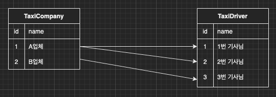

이번 장에서는 [JPQL-1(링크)](https://imprint.tistory.com/122?category=1061011)에 이어 JPQL의 Fetch Join에 대해서 알아본다.
글의 하단부에 참고한 강의와 공식문서의 경로를 첨부하였으므로 자세한 사항은 강의나 공식문서에서 확인한다.
Class와 Entity에 대한 설명은 JPQL-1의 글에서 확인한다.

---

### Fetch Join

Fetch Join은 실제로 DB에 존재하는 Join의 종류가 아니다.
JPQL의 성능 향상을 위해 존재하는 개념이다.
이전에 성능 및 유지보수를 위하여 모든 연관 관계는 Lazy로 설정해두었다.
이렇게 설정하는 경우 N + 1 문제를 피하기 어렵다. Lazy로 설정되어 있는 Entity들도 한 번에 조회하기 위해 사용하는 것이 Fetch Join이다.

아래와 같이 택시 기사(TaxiDriver)를 조회하고 기사의 업체(TaxiCompany)의 이름을 조회하면 기사의 수(N)만큼 쿼리가 추가로 발생한다.
(물론 한 번 조회되어 1차 캐시에 저장되어 있는 경우는 쿼리가 발생하지 않는다.)

```java
String query = "SELECT " +
               "TD " +
               "FROM TaxiDriver TD ";
List<TaxiDriver> result = entityManager.createQuery(query, TaxiDriver.class)
        .getResultList();
result.forEach(i -> {
    System.out.println("i.getTaxiCompany().getName() = " + i.getTaxiCompany().getName());
});
```

```sql
-- Driver 목록을 가져오기 위해 쿼리 발생
Hibernate: 
    /* SELECT
        TD 
    FROM
        TaxiDriver TD  */ select
            taxidriver0_.id as id1_2_,
            taxidriver0_.name as name2_2_,
            taxidriver0_.phone as phone3_2_,
            taxidriver0_.taxi_company_id as taxi_com4_2_ 
        from
            TaxiDriver taxidriver0_
-- 1, 2번 기사의 업체 정보를 가져오기 위해 쿼리 발생             
Hibernate: 
    select
        taxicompan0_.id as id1_1_0_,
        taxicompan0_.name as name2_1_0_,
        taxicompan0_.phone as phone3_1_0_ 
    from
        TaxiCompany taxicompan0_ 
    where
        taxicompan0_.id=?
i.getTaxiCompany().getName() = 1번 업체
i.getTaxiCompany().getName() = 1번 업체
-- 3번 기사의 업체 정보를 가져오기 위해 쿼리 발생
Hibernate: 
    select
        taxicompan0_.id as id1_1_0_,
        taxicompan0_.name as name2_1_0_,
        taxicompan0_.phone as phone3_1_0_ 
    from
        TaxiCompany taxicompan0_ 
    where
        taxicompan0_.id=?
i.getTaxiCompany().getName() = 2번 업체
```

쿼리를 Fetch Join을 추가하면 TaxiDriver를 조회할 때 TaxiCompany의 정보도 동시에 조회하기 때문에
추가로 발생하는 쿼리가 없다.

```java
String query = "SELECT " +
               "TD " +
               "FROM TaxiDriver TD JOIN FETCH TD.taxiCompany ";
List<TaxiDriver> result = entityManager.createQuery(query, TaxiDriver.class)
        .getResultList();
result.forEach(i -> {
    System.out.println("i.getTaxiCompany().getName() = " + i.getTaxiCompany().getName());
});
```

```sql
-- 한 번의 쿼리로 원하는 결과를 모두 추출
Hibernate: 
    /* SELECT
        TD 
    FROM
        TaxiDriver TD 
    JOIN
        FETCH TD.taxiCompany  */ select
            taxidriver0_.id as id1_2_0_,
            taxicompan1_.id as id1_1_1_,
            taxidriver0_.name as name2_2_0_,
            taxidriver0_.phone as phone3_2_0_,
            taxidriver0_.taxi_company_id as taxi_com4_2_0_,
            taxicompan1_.name as name2_1_1_,
            taxicompan1_.phone as phone3_1_1_ 
        from
            TaxiDriver taxidriver0_ 
        inner join
            TaxiCompany taxicompan1_ 
                on taxidriver0_.taxi_company_id=taxicompan1_.id
i.getTaxiCompany().getName() = 1번 업체
i.getTaxiCompany().getName() = 1번 업체
i.getTaxiCompany().getName() = 2번 업체
```

단일 Entity에 Fetch Join을 사용하면 문제없이 한 번에 조회가 가능하다.

---

### Collection Fetch Join

이번에는 Collection에 Fetch Join을 사용해본다.
데이터는 아래의 그림과 같이 A업체에 1번 기사님과 2번 기사님이 포함되어 있고 B업체에 3번 기사님이 포함되어 있다.



A업체를 조회하면서 Fetch Join을 사용하여 기사까지 동시에 조회하면 조회 결과는 총 두개가 된다.
A업체는 단 하나이지만 이에 속하는 기사가 두 명이기 때문에 조회되는 row의 수가 두개가 된 것이다.
또한 기사의 수에 따라 row의 수가 늘어난 것이기 때문에 Entity의 주소값이 동일한 것을 확인할 수 있다.

```java
String query = "SELECT " +
               "TC " +
               "FROM TaxiCompany TC JOIN FETCH TC.taxiDrivers " +
               "WHERE TC.name = 'A업체'";
List<TaxiCompany> result = entityManager.createQuery(query, TaxiCompany.class)
        .getResultList();
result.forEach(i -> {
    System.out.println("업체의 주소값 = " + i.toString());
    for (TaxiDriver taxiDriver : i.getTaxiDrivers()) {
        System.out.println("기사의 주소값 = " + taxiDriver.toString());
    }
});
```

```sql
Hibernate: 
    /* SELECT
        TC 
    FROM
        TaxiCompany TC 
    JOIN
        FETCH TC.taxiDrivers 
    WHERE
        TC.name = 'A업체' */ select
            taxicompan0_.id as id1_1_0_,
            taxidriver1_.id as id1_2_1_,
            taxicompan0_.name as name2_1_0_,
            taxicompan0_.phone as phone3_1_0_,
            taxidriver1_.name as name2_2_1_,
            taxidriver1_.phone as phone3_2_1_,
            taxidriver1_.taxi_company_id as taxi_com4_2_1_,
            taxidriver1_.taxi_company_id as taxi_com4_2_0__,
            taxidriver1_.id as id1_2_0__ 
        from
            TaxiCompany taxicompan0_ 
        inner join
            TaxiDriver taxidriver1_ 
                on taxicompan0_.id=taxidriver1_.taxi_company_id 
        where
            taxicompan0_.name='A업체'
업체의 주소값 = com.roy.jpa.theory.entity.TaxiCompany@4f4c88f9
기사의 주소값 = com.roy.jpa.theory.entity.TaxiDriver@2a53f215
기사의 주소값 = com.roy.jpa.theory.entity.TaxiDriver@15c487a8
업체의 주소값 = com.roy.jpa.theory.entity.TaxiCompany@4f4c88f9
기사의 주소값 = com.roy.jpa.theory.entity.TaxiDriver@2a53f215
기사의 주소값 = com.roy.jpa.theory.entity.TaxiDriver@15c487a8
```

---

### Distinct

위에서 Collection에 Fetch Join을 사용하는 방법을 알아보았다. 
하지만 우리가 원하는 결과는 A업체는 단 하나이기 때문에 하나의 A업체만 조회되는 결과이다.
JPQL의 Distinct를 사용하면 중복되는 데이터를 지울 수 있다.
(row의 모든 결과가 동일해야 지워지는 DB의 distinct와는 차이가 있다.)

Distinct를 추가하고 결과 값을 확인해본다.

```java
String query = "SELECT " +
               "DISTINCT TC " +
               "FROM TaxiCompany TC JOIN FETCH TC.taxiDrivers " +
               "WHERE TC.name = 'A업체'";
List<TaxiCompany> result = entityManager.createQuery(query, TaxiCompany.class)
        .getResultList();
result.forEach(i -> {
    System.out.println("업체의 주소값 = " + i.toString());
    for (TaxiDriver taxiDriver : i.getTaxiDrivers()) {
        System.out.println("기사의 주소값 = " + taxiDriver.toString());
    }
});
```

```sql
Hibernate: 
    /* SELECT
        DISTINCT TC 
    FROM
        TaxiCompany TC 
    JOIN
        FETCH TC.taxiDrivers 
    WHERE
        TC.name = 'A업체' */ select
            distinct taxicompan0_.id as id1_1_0_,
            taxidriver1_.id as id1_2_1_,
            taxicompan0_.name as name2_1_0_,
            taxicompan0_.phone as phone3_1_0_,
            taxidriver1_.name as name2_2_1_,
            taxidriver1_.phone as phone3_2_1_,
            taxidriver1_.taxi_company_id as taxi_com4_2_1_,
            taxidriver1_.taxi_company_id as taxi_com4_2_0__,
            taxidriver1_.id as id1_2_0__ 
        from
            TaxiCompany taxicompan0_ 
        inner join
            TaxiDriver taxidriver1_ 
                on taxicompan0_.id=taxidriver1_.taxi_company_id 
        where
            taxicompan0_.name='A업체'
업체의 주소값 = com.roy.jpa.theory.entity.TaxiCompany@4f4c88f9
기사의 주소값 = com.roy.jpa.theory.entity.TaxiDriver@2a53f215
기사의 주소값 = com.roy.jpa.theory.entity.TaxiDriver@15c487a8
```

우리가 원하는 것과 같이 하나의 A업체만 조회된 것을 확인할 수 있다.
하지만 어디까지나 DB의 결과를 JPA에서 가공한 결과일 뿐이다. 이렇게 조회하는 경우 DB의 결과 값과 우리가 보는 데이터의 수량이 바뀌기 때문에 페이징 처리가 불가능하다.
이 글의 하단부에서 batch_fetch를 사용하여 1 + 1 쿼리로 페이징처리를 해결하는 방법을 알아볼 것이다.

---

### Fetch Join 특징

이번에는 Fetch Join과 일반 Join의 차이를 알아본다.
JPQL에서 결과를 반환할 때는 연관관계를 고려하지 않고 우리가 적어놓은 SELECT 절의 엔티티만 조회한다.

```java
"SELECT " +
" TC " +
"FROM TaxiCompany TC JOIN TC.taxiDrivers";
```

```sql
Hibernate: 
    select
        taxidriver0_.taxi_company_id as taxi_com4_2_0_,
        taxidriver0_.id as id1_2_0_,
        taxidriver0_.id as id1_2_1_,
        taxidriver0_.name as name2_2_1_,
        taxidriver0_.phone as phone3_2_1_,
        taxidriver0_.taxi_company_id as taxi_com4_2_1_ 
    from
        TaxiDriver taxidriver0_ 
    where
        taxidriver0_.taxi_company_id=?
```

하지만 Fetch Join의 경우 연관된 Entity도 동시에 조회를 한다. 마치 즉시로딩(FetchType.EAGER)처럼 동작하는 것이다.

```java
"SELECT " +
" TC " +
"FROM TaxiCompany TC JOIN FETCH TC.taxiDrivers";
```

```sql
Hibernate: 
    /* SELECT
        TC 
    FROM
        TaxiCompany TC 
    JOIN
        FETCH TC.taxiDrivers */ select
            taxicompan0_.id as id1_1_0_,
            taxidriver1_.id as id1_2_1_,
            taxicompan0_.name as name2_1_0_,
            taxicompan0_.phone as phone3_1_0_,
            taxidriver1_.name as name2_2_1_,
            taxidriver1_.phone as phone3_2_1_,
            taxidriver1_.taxi_company_id as taxi_com4_2_1_,
            taxidriver1_.taxi_company_id as taxi_com4_2_0__,
            taxidriver1_.id as id1_2_0__ 
        from
            TaxiCompany taxicompan0_ 
        inner join
            TaxiDriver taxidriver1_ 
                on taxicompan0_.id=taxidriver1_.taxi_company_id
```

일반 Join과는 다르게 Fetch Join은 대상에게 별칭을 줄 수 없다.
(물론 별칭을 주는 것이 불가능한 것은 아니지만 데이터의 정합성을 위해 사용해서는 안된다.)

위에서 본 것처럼 컬렉션과 Fetch Join하는 경우 데이터가 우리가 예상하는 것과 다르게 늘어나는 것을 확인하였다.
이러한 이유로 둘 이상의 컬렉션과 Fetch Join은 불가능하다.
(물론 가능하다. 하지만 예상치 못한 양과 결과를 마주하게 된다.)

컬렉션을 Fetch Join하는 경우 페이징 API를 사용할 수 없다.
물론 사용이 불가능한 것은 아니다. 하지만 불가능하다고 이해하고 사용해서는 안된다. 
실제로 발생되는 쿼리에는 페이징 관련 쿼리가 없다. 모든 데이터를 읽어온 이후에 페이징 처리를 한다.

```java
String query = "SELECT " +
               " TC " +
               "FROM TaxiCompany TC JOIN FETCH TC.taxiDrivers";
List<TaxiCompany> result = entityManager.createQuery(query, TaxiCompany.class)
        .setFirstResult(10)
        .setMaxResults(20)
        .getResultList();
```

applying in memory 부분을 주목해서 확인해야한다.
물론 데이터가 적은 경우 체감하지 못할 수 있지만 많은 양의 데이터를 이러한 식으로 처리한다면 언젠가 쿼리 한 번에 서비스가 OOM으로 사망하는 순간을 맞이하게 될 것이다.

```sql
WARN: HHH000104: firstResult/maxResults specified with collection fetch; applying in memory!
Hibernate: 
    /* SELECT
        TC 
    FROM
        TaxiCompany TC 
    JOIN
        FETCH TC.taxiDrivers */ select
            taxicompan0_.id as id1_1_0_,
            taxidriver1_.id as id1_2_1_,
            taxicompan0_.name as name2_1_0_,
            taxicompan0_.phone as phone3_1_0_,
            taxidriver1_.name as name2_2_1_,
            taxidriver1_.phone as phone3_2_1_,
            taxidriver1_.taxi_company_id as taxi_com4_2_1_,
            taxidriver1_.taxi_company_id as taxi_com4_2_0__,
            taxidriver1_.id as id1_2_0__ 
        from
            TaxiCompany taxicompan0_ 
        inner join
            TaxiDriver taxidriver1_ 
                on taxicompan0_.id=taxidriver1_.taxi_company_id
```

---

### Batch Fetch

지금까지 Fetch Join과 Distinct를 살펴보았다.
하지만 아직까지 해결되지 않은 문제가 있는데 바로 컬렉션에 Fetch Join을 사용한 경우다.
어떠한 방식으로도 안정적으로 페이징 API를 사용할 수 없었다.

Batch Fetch를 사용하면 1 + 1 쿼리만으로 페이징 처리가 가능하다.
아래와 같이 컬렉션 Entity와 연관 관계를 맺은 부분에 BatchSize 어노테이션을 사용한다.

```java
public class TaxiCompany {

    @Id
    @GeneratedValue
    private Long id;
    private String name;
    private String phone;

    @BatchSize(size = 1000)
    @OneToMany(mappedBy = "taxiCompany")
    private List<TaxiDriver> taxiDrivers = new ArrayList<>();

}
```

이전과 동일한 방법으로 데이터를 조회한 결과는 아래와 같다.

```java
String query = "SELECT " +
               " TC " +
               "FROM TaxiCompany TC";
List<TaxiCompany> result = entityManager.createQuery(query, TaxiCompany.class)
        .setFirstResult(0)
        .setMaxResults(2)
        .getResultList();
```

최초에 기사의 정보는 가져오지 않고 업체의 정보만 조회한다.
이후에 기사의 정보가 초기화될 때 N번의 쿼리를 발생시키는 것이 아니라 IN 쿼리를 사용하여 1번만 추가로 쿼리를 발생시킨다.

```sql
Hibernate: 
    /* SELECT
        TC 
    FROM
        TaxiCompany TC */ select
            taxicompan0_.id as id1_1_,
            taxicompan0_.name as name2_1_,
            taxicompan0_.phone as phone3_1_ 
        from
            TaxiCompany taxicompan0_ limit ?
업체의 주소값 = com.roy.jpa.theory.entity.TaxiCompany@7523a3dc
Hibernate: 
    /* load one-to-many com.roy.jpa.theory.entity.TaxiCompany.taxiDrivers */ select
        taxidriver0_.taxi_company_id as taxi_com4_2_1_,
        taxidriver0_.id as id1_2_1_,
        taxidriver0_.id as id1_2_0_,
        taxidriver0_.name as name2_2_0_,
        taxidriver0_.phone as phone3_2_0_,
        taxidriver0_.taxi_company_id as taxi_com4_2_0_ 
    from
        TaxiDriver taxidriver0_ 
    where
        taxidriver0_.taxi_company_id in (
            ?, ?
        )
기사의 주소값 = com.roy.jpa.theory.entity.TaxiDriver@41da3aee
기사의 주소값 = com.roy.jpa.theory.entity.TaxiDriver@7fb53256
업체의 주소값 = com.roy.jpa.theory.entity.TaxiCompany@75e27856
기사의 주소값 = com.roy.jpa.theory.entity.TaxiDriver@1d6d1d42
```

깔끔하게 한 번의 쿼리만으로 해결되지는 않았지만 1 + 1 번 만의 쿼리만으로 컬렉션에도 페이징 API를 사용할 수 있게 되었다.

Batch Fatch의 경우 @BatchSize 어노테이션을 사용하지 않고 글로벌 설정으로 지정할 수도 있다.
META-INF/persistence.xml 파일에 아래와 같은 속성을 추가하면 각각의 연관관계마다 BatchSize를 지정하지 않아도 동일하게 작동시킬 수 있다.

```xml
<property name="hibernate.default_batch_fetch_size" value="1000"/>
```

---

참고한 강의: https://www.inflearn.com/course/ORM-JPA-Basic

JPA 공식 문서: https://docs.spring.io/spring-data/jpa/docs/current/reference/html/#reference

위키백과: https://ko.wikipedia.org/wiki/%EC%9E%90%EB%B0%94_%ED%8D%BC%EC%8B%9C%EC%8A%A4%ED%84%B4%EC%8A%A4_API