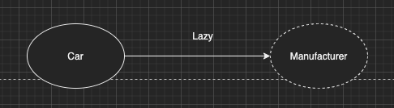

이번 장에서는 [프록시 (링크)](https://imprint.tistory.com/118?category=1003393)에 이어 즉시 로딩과 지연 로딩에 대해서 알아본다.
글의 하단부에 참고한 강의와 공식문서의 경로를 첨부하였으므로 자세한 사항은 강의나 공식문서에서 확인한다.

---

프록시에서 JPA에서 어떻게 프록시 객체를 관리하는지에 대해서 알아보았다.
이번에는 직접 차량(Car)과 제조사(Manufacturer)를 예로 직접 로딩과 지연 로딩을 구현해본다.

### 지연 로딩(Lazy Loading)

만약 차량을 조회할 때 제조사의 정보가 필요가 없다면 매번 제조사의 정보를 DB에서 조회하는 것은 불필요한 자원낭비가 된다.
이러한 경우 FetchType을 지정하여 지연 로딩을 설정할 수 있다.

```java
@Entity
public class Car {
    @Id
    @GeneratedValue
    private Long id;
    @Column(name = "model_name")
    private String modelName;
    @ManyToOne(fetch = FetchType.LAZY)
    @JoinColumn(name = "manufacturer_id")
    private Manufacturer manufacturer;
}
```

이렇게 Entity를 설계하고 차량을 조회하면 JPA는 Car를 조회할 때 Manufacturer의 정보를 가져오지 않는다.
아래와 같이 조회한다면 제조사의 정보는 비어있게 될 것이다.
Car storedCar = entityManager.find(Car.class, 1L); 



만약 제조사의 정보가 필요해져서 제조사의 이름을 가져오게 된다면 필요한 시점에 DB를 조회하여 제조사의 정보를 가져올 것이다.
storedCar.getManufacturer().getName();


만약 차량의 정보와 제조사의 정보가 항상 같이 필요하다면 FetchType의 EAGER를 사용하면 된다.

---

### 즉시 로딩(Eager Loading)

만약 차량의 정보를 조회할 때 항상 제조사의 정보까지 필요하다면 차량 Entity를 아래와 같이 수정하면 된다.

```java
@Entity
public class Car {
    @Id
    @GeneratedValue
    private Long id;
    @Column(name = "model_name")
    private String modelName;
    @ManyToOne(fetch = FetchType.EAGER)
    @JoinColumn(name = "manufacturer_id")
    private Manufacturer manufacturer;
}
```

이렇게 선언이 되어 있다면 Lazy Loading과는 다르게 차량만 조회하더라도 제조사의 정보가 있게된다.

Car storedCar = entityManager.find(Car.class, 1L);


---

### 즉시 로딩 주의 사항

즉시 로딩을 사용하면 개발자가 예상하지 못한 SQL이 발생한다.
또한 즉시 로딩은 JPQL에서 1 + N의 문제를 일으킨다.
@ManyToOne, @OneToOne은 기본이 즉시 로딩이므로 LAZY로 설정하여 즉시 로딩되는 일이 없도록 주의하여야한다.

**모든 경우에 지연 로딩(Lazy Loading)을 사용**하고 예시처럼 제조사의 정보가 필요한 경우는 fetch 조인이나 엔티티 그래프를 활용하여 해결해야한다.

---

참고한 강의: https://www.inflearn.com/course/ORM-JPA-Basic

JPA 공식 문서: https://docs.spring.io/spring-data/jpa/docs/current/reference/html/#reference

위키백과: https://ko.wikipedia.org/wiki/%EC%9E%90%EB%B0%94_%ED%8D%BC%EC%8B%9C%EC%8A%A4%ED%84%B4%EC%8A%A4_API