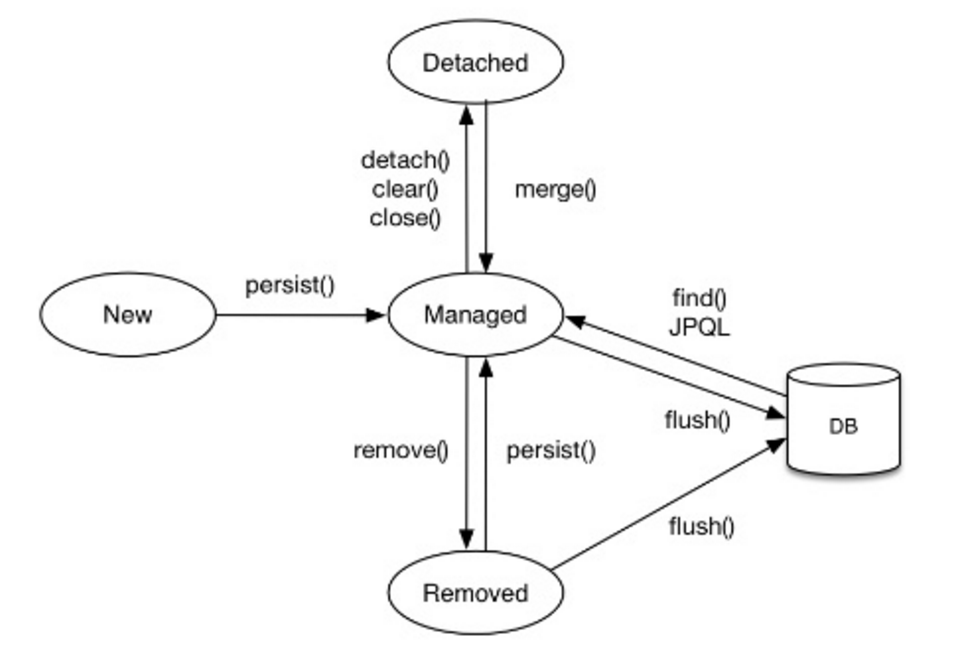

이번 장에서는 JPA의 병합(이하 Merge)에 자세하게 알아본다.
Merge를 이해하기 위해서는 [Entity의 생명주기 (링크)](https://imprint.tistory.com/112)를 이해하고 있어야한다.
글의 하단부에 참고한 강의와 공식문서의 경로를 첨부하였으므로 자세한 사항은 강의나 공식문서에서 확인한다.

---

### 준영속 Entity



준영속 상태의 Entity는 id가 존재해야한다.
id가 존재한다는 것은 DB에 한 번이라도 Insert되었다는 의미가 된다.
id는 존재하지만 영속성 컨텍스트의 관리를 받지 못하는 상태를 의미한다.

이번 장에서는 잘못된 API 설계로 클라이언트가 Entity를 수정하기 위해서 서버로 Entity를 전달하고 수정하는 상황을 만들어본다.
이러한 상황에서 Merge를 사용하면 발생하는 문제를 확인해보고 어떠한 방식으로 풀어야하는지에 대해서 알아본다.

---

### Class & Flow

Merge의 작동방식을 확인하기 위한 클래스들과 클래스들의 호출 순서이다.


**TaxiDriver:** 기사의 Entity 클래스.

```java
@Entity
@ToString
@Table(name = "taxi_driver")
@Getter @Setter
public class TaxiDriver {

    @Id
    @GeneratedValue
    @Column(name = "taxi_driver_id")
    private Long id;

    private String name;
    private String license;
    private String phone;

}
```

**TaxiDriverService:** 클라이언트로 부터 전달받은 값을 가공하는 역할을 한다.

```java
@Service
@Transactional
@RequiredArgsConstructor
public class TaxiDriverService {

    private final TaxiDriverRepository repository;

    public void saveTaxiDriver(TaxiDriver inputTaxiDriver) {
        repository.persist(inputTaxiDriver);
    }

    public TaxiDriver updateTaxiDriver(TaxiDriver inputTaxiDriver) {
        return repository.merge(inputTaxiDriver);
    }

}
```

**TaxiDriverRepository:** Service로 부터 전달받은 값을 EntityManager에게 persist 또는 merge 하는 역할을 한다.

```java
@Repository
@RequiredArgsConstructor
public class TaxiDriverRepository {
    private final EntityManager entityManager;

    public void persist(TaxiDriver taxiDriver) {
        entityManager.persist(taxiDriver);
    }

    public TaxiDriver merge(TaxiDriver taxiDriver) {
        return entityManager.merge(taxiDriver);
    }

}
```

**TaxiDriverTest:** 기사의 수정을 요청할 클라이언트 역할을 한다.

```java
@SpringBootTest
public class TaxiDriverTest {

    @Autowired
    private TaxiDriverService service;

    @Test
    void mergeTest() {
        TaxiDriver taxiDriver1 = new TaxiDriver();
        taxiDriver1.setName("Roy");
        taxiDriver1.setPhone("010~");
        taxiDriver1.setLicense("111~");
        service.saveTaxiDriver(taxiDriver1);

        long storedTaxiDriverId = taxiDriver1.getId();

        TaxiDriver taxiDriver2 = new TaxiDriver();
        taxiDriver2.setId(storedTaxiDriverId);
        taxiDriver2.setName("Perry");
        TaxiDriver storedTaxiDriver = service.updateTaxiDriver(taxiDriver2);

        System.out.println("storedTaxiDriver 이름: " + storedTaxiDriver.getName());
        System.out.println("storedTaxiDriver 휴대폰 번호: " + storedTaxiDriver.getPhone());
        System.out.println("storedTaxiDriver 자격증 번호: " + storedTaxiDriver.getLicense());
    }

}
```

---

### Merge를 통한 수정의 한계

TaxiDriverTest 클래스를 확인해보면  TaxiDriver1을 생성하고 이름을 "Roy"로 입력하고 저장하였다.
저장할 때 생성된 아이디를 저장하고 수정하기 위한 TaxiDriver2을 생성하고 아이디를 입력하였다.
추가로 원하는 수정되기 원하는 이름을 "Perry"로 바꾸고 저장하였다.

우리가 원하는 storedTaxiDriver 인스턴스의 상태는 수정된 결과물이기 때문에 
이름은 "Perry", 휴대폰 번호는 "010~", 자격증 번호는 "111~"이다.
출력된 결과는 아래와 같다.

```bash
storedTaxiDriver 이름: Perry
storedTaxiDriver 휴대폰 번호: null
storedTaxiDriver 자격증 번호: null
```

휴대폰 번호와 자격증 번호가 우리의 예상과는 다르게 "null"로 변해있었다.
원인을 찾기 위해서는 Merge의 작동방식을 이해해야한다.


1. 테스트 코드가 taxiDriver2의 수정을 요청했다. 이때 TaxiDriverRepository가 영속성 컨텍스트에 Merge를 요청한다. 

2. 영속성 컨텍스트는 1차 캐시를 확인하고 결과가 없다면 2.1 단계와 같이 DB를 Select하여 기존에 이름이 Roy인 Entity(이하 Roy)를 캐싱한다.

캐싱되고 Roy의 현재 상태는 아래와 같다.
```bash
id: 1
name: Roy
phone: 010~
license: 111~
```

3. 영속성 컨텍스트는 Merge를 요청한 준영속 Entity인 이름이 "Perry"인 Entity(이하 Perry)의 모든 값을 Roy에게 대입한다.

이렇게 Perry의 모든 값이 덮어씌여진 Roy의 상태는 아래와 같다.
```bash
id: 1
name: Perry
phone: null
license: null
```

4. 영속성 컨텍스트는 이렇게 값이 변환된 Roy를 리턴한다.

어떻게 보면 당연한 것이지만 Merge는 우리가 원하는 것과 다르게 작동한다.
(마치 HttpMethod의 Put과 유사하다.)

### 변경 감지를 통한 수정

물론 아래와 같이 Repository의 코드를 수정하면 이러한 문제를 해결할 수 있다.
id가 없는 경우(한번도 DB에 Insert된적 없는 Entity)에만 Merge를 하게하면 문제를 해결할 수 있다.
하지만 이러한 분기처리는 또 다른 Side Effect를 야기한다.

```java
@Repository
@RequiredArgsConstructor
public class TaxiDriverRepository {
    private final EntityManager entityManager;
    
    public void save(TaxiDriver taxiDriver) {
        if (Objects.isNull(taxiDriver.getId())) {
            entityManager.persist(taxiDriver);
        } else {
            entityManager.merge(taxiDriver);
        }
    }

}
```

**변경 감지(Dirty Checking)**은 Flush 시점에 EntityManager가 생성한 최초의 Entity상태의 스냅샷과
Flush 시점의 Entity 상태를 비교하여 변경된 부분을 찾고 DB에 Update 쿼리를 실행하는 것을 의미한다.

이제 Merge는 잊고 변경 감지를 통한 수정 방법에 대해서 알아본다.
수정 된 TaxiDriverService의 코드는 아래와 같다. 
클라이언트로부터 입력받은 inputTaxiDriver를 사용하는 것이 아니라 repository(결과적으로 EntityManager를 통해서)에서 영속성 관리를 받는 storedTaxiDriver를 생성하였다.
이후 storedTaxiDriver Entity는 입력받은 inputTaxiDriver Entity에서 필요한 이름 값만 대입하였다.
마지막 Transaction이 끝나는 시점에 EntityManager의 변경 감지를 통해 변경 사항이 DB에 반영된다.

```java
@Service
@Transactional
@RequiredArgsConstructor
public class TaxiDriverService {

    private final TaxiDriverRepository repository;

    public void saveTaxiDriver(TaxiDriver inputTaxiDriver) {
        repository.persist(inputTaxiDriver);
    }

    public TaxiDriver updateTaxiDriver(TaxiDriver inputTaxiDriver) {
        TaxiDriver storedTaxiDriver = repository.get(inputTaxiDriver.getId());
        storedTaxiDriver.setName(Objects.nonNull(inputTaxiDriver.getName()) ? inputTaxiDriver.getName() : storedTaxiDriver.getName());
        return repository.get(inputTaxiDriver.getId());
    }

}
```

변경 이후 테스트 결과는 아래와 같다.
우리가 원하는 결과를 얻었다.

```bash
storedTaxiDriver 이름: Perry
storedTaxiDriver 휴대폰 번호: 01011112222
storedTaxiDriver 자격증 번호: 333344445555
```

---

### 유지보수를 위한 리팩토링

지금까지 Merge를 통한 수정과 변경 감지(dirty Checking)를 통한 수정에 대해서 알아보았다.
결과적으로 우리는 **변경 감지**를 통해서 Entity를 수정해야한다.

하지만 마지막으로 수정된 TaxiDriverService를 보면 직접 Entity에 set을 통해 값을 입력하고 있다.
또 다른 어딘가의 코드에서는 이름과 휴대폰 번호를 수정하고 있을 것이다.

이러한 상황에서 "이제 더 이상 휴대폰 번호는 수정할 수 없다."라는 회사 규정이 생긴다면 우리는 모든 변경 지점을 탐색하여 수정해야한다.
지금부터 이러한 상황을 유연하게 대처하기 위해 코드를 리팩토링 할 것이다.

**TaxiDriver**

업데이트를 위한 클래스인 UpdateDTO가 추가되었다.
UpdateDTO는 수정 불가능한 name 속성을 가지고 있지 않다.
(완벽한 캡슐화를 위해서 TaxiDriver의 @Setter를 제거해야하지만 테스트 코드 작성을 위해 살려두었음, @Setter가 없다는 가정하에 설명)

@Setter가 없는 상황에서 Entity를 수정하는 모든 코드들은 수정 메서드인 update를 통해야한다.
회사의 규정이 변하더라도 우리는 변경지점이 단 한 곳이기 때문에 모든 곳을 찾아서 수정할 필요가 없다.

```java
@Entity
@ToString
@Table(name = "taxi_driver")
@Getter @Setter
public class TaxiDriver {

    @Id
    @GeneratedValue
    @Column(name = "taxi_driver_id")
    private Long id;

    private String name;
    private String license;
    private String phone;

    @Builder
    @Getter @Setter
    public static class UpdateDTO {
        private Long id;
        private String name;
        private String license;
    }

    public void update(UpdateDTO dto) {
        Assert.notNull(dto.name, "이름은 필수입니다.");
        Assert.notNull(dto.license, "자격증 번호는 필수입니다.");
        this.name = dto.name;
        this.license = dto.license;
    }

}
```

**TaxiDriverService**

이제 수정을 위해서 Entity 대신 DTO를 입력받도록 변경되었다.
더 이상 Entity가 파라미터로 돌아다니는 위험한 상황에 노출되지 않아도 된다.

```java
@Service
@Transactional
@RequiredArgsConstructor
public class TaxiDriverService {

    private final TaxiDriverRepository repository;

    public void saveTaxiDriver(TaxiDriver inputTaxiDriver) {
        repository.persist(inputTaxiDriver);
    }

    public TaxiDriver updateTaxiDriver(TaxiDriver.UpdateDTO dto) {
        TaxiDriver storedTaxiDriver = repository.get(dto.getId());
        storedTaxiDriver.update(dto);
        return repository.get(dto.getId());
    }

}
```

**TaxiDriverTest**

클라이언트도 더 이상 수정을 위해서 Entity 객체를 생성하고 전달하지 않는다.
수정을 위한 DTO 객체를 생성하고 파라미터로 전송한다.

```java
@SpringBootTest
public class TaxiDriverTest {

    @Autowired
    private TaxiDriverService service;

    @Test
    void mergeTest() {
        TaxiDriver taxiDriver1 = new TaxiDriver();
        taxiDriver1.setName("Roy");
        taxiDriver1.setPhone("01011112222");
        taxiDriver1.setLicense("333344445555");
        service.saveTaxiDriver(taxiDriver1);

        long storedTaxiDriverId = taxiDriver1.getId();

        TaxiDriver.UpdateDTO dto = TaxiDriver.UpdateDTO.builder()
                .id(storedTaxiDriverId)
                .name("Perry")
                .license("새로운 자격증 번호")
                .build();
        TaxiDriver storedTaxiDriver = service.updateTaxiDriver(dto);

        System.out.println("storedTaxiDriver 이름: " + storedTaxiDriver.getName());
        System.out.println("storedTaxiDriver 휴대폰 번호: " + storedTaxiDriver.getPhone());
        System.out.println("storedTaxiDriver 자격증 번호: " + storedTaxiDriver.getLicense());
    }

}
```

---

참고한 강의: 

- https://www.inflearn.com/course/%EC%8A%A4%ED%94%84%EB%A7%81%EB%B6%80%ED%8A%B8-JPA-%ED%99%9C%EC%9A%A9-1
- https://www.inflearn.com/course/ORM-JPA-Basic

JPA 공식 문서: https://docs.spring.io/spring-data/jpa/docs/current/reference/html/#reference

위키백과: https://ko.wikipedia.org/wiki/%EC%9E%90%EB%B0%94_%ED%8D%BC%EC%8B%9C%EC%8A%A4%ED%84%B4%EC%8A%A4_API