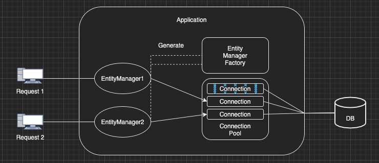

이번 장에서는 영속성에 대해서 알아본다.
번역상으로 Persistence는 "지속됨", "고집"으로 번역되지만 이 글에서는 "Persistence = 영속"이라 정의한다.
글의 하단부에 참고한 강의와 공식문서의 경로를 첨부하였으므로 자세한 사항은 강의나 공식문서에서 확인한다.

---

### Persistence Context

JPA에서 가장 중요한 개념 두 가지가 있다.
첫번째는 객체와 관계형 데이터베이스를 매핑(Object Relational Mapping)하는 것이며
두번째는 영속성 컨텍스트의 개념을 정확히 이해하고 사용하는 것이다.

Persistence Context(영속성 컨텍스트)를 이해하기 위해 Entity Manager와 Entity Manager Factory의 개념을 이해해야한다.



---

#### Entity Manager

JPA에서 메모리상에서 데이터인 Entity를 관리(Manage)해주는 기능이다. 
Entity Manager는 Entity를 CRUD를 모두 담당한다. Entity Manager Factory와 달리 Thread-Safe하지 않기 때문에
Thread간에 공유하지 않아야하며 재사용해서는 안된다. 일반적으로 개발자가 직접 Entity Manager Factory가 생성한 것을 사용하는 것이 아니라 
Spring에서 관리하는 프록시 Entity Manager를 사용하게 되고 Spring에 의해 Thread-Safe한 Entity Manager를 사용할 수 있게 된다.

---

#### Entity Manager Factory

Entity Manager를 생성하는 역할을 한다.
일반적으로 하나의 어플리케이션에 하나만 존재하며 다중 쓰레드가 접근하더라도 Thread-Safe하다.
Hibernate에는 대표적으로 SessionFactory가 있다.

다시 영속성 컨텍스트로 돌아와서 영속성 컨텍스트란 "엔티티를 영구 저장하는 환경"이라는 의미이다.
Entity Manager를 통해 영속성 컨텍스트에 접근하여 Entity를 다루게 된다.

J2SE 환경에서는 엔티티 매니저와 영속성 컨텍스트가 1:1 관계이다.


J2EE, 스프링 프레임워크 환경에서는 엔티티 매니저와 영속성 컨텍스트가 N:1 관계이다.


---

#### Entity의 생명 주기

- 비영속 (new/transient): 영속성 컨텍스트와 전혀 관계가 없는 새로운 상태.

```java
// 객체를 생성한 상태
User user = new User();
user.setId(1L);
user.setName("이름");
```


- 영속 (managed): 영속성 컨텍스트에 관리되는 상태.

```java
EntityManager entityManager = EntityManagerFactory.createEntityManager();

// 객체를 생성한 상태(비영속)
User user = new User();
user.setId(1L);
user.setName("이름");

// 객체를 저장한 상태(영속)
entityManager.persist(user);
```


- 준영속 (detached): 영속성 컨텍스트에 저장되었다가 분리된 상태.

```java
// 유저 엔티티를 영속성 컨텍스트에서 분리, 준영속 상태
entityManager.detach(user);
```

- 삭제 (removed): 삭제된 상태.

```java
// 객체를 삭제한 상태
entityManager.remove(user);
```

---

참고한 강의: https://www.inflearn.com/course/ORM-JPA-Basic

JPA 공식 문서: https://docs.spring.io/spring-data/jpa/docs/current/reference/html/#reference

위키백과: https://ko.wikipedia.org/wiki/%EC%9E%90%EB%B0%94_%ED%8D%BC%EC%8B%9C%EC%8A%A4%ED%84%B4%EC%8A%A4_API