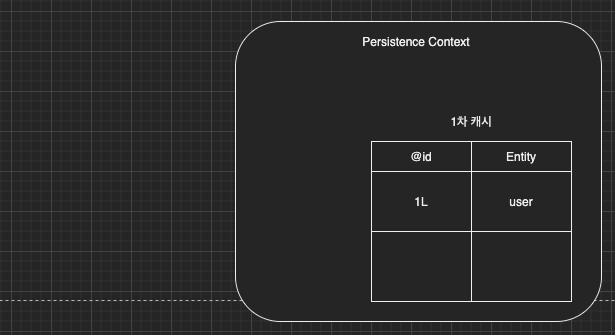
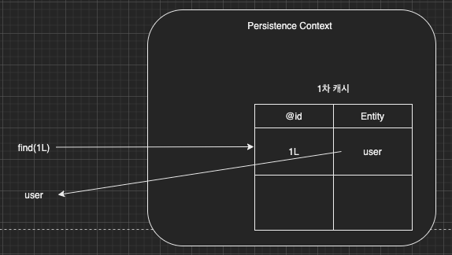
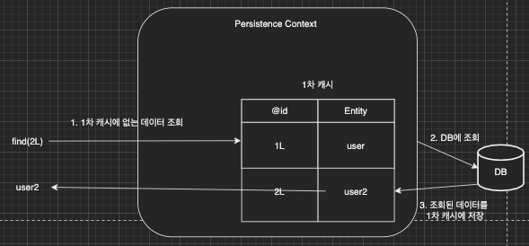
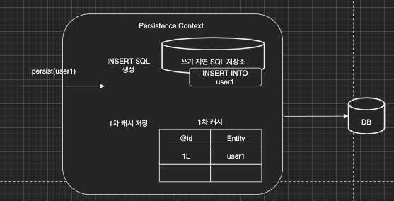
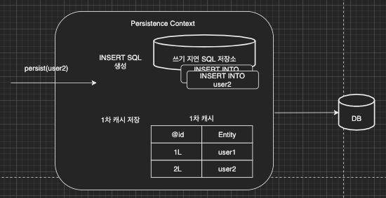
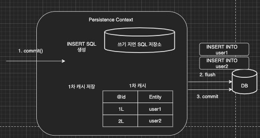
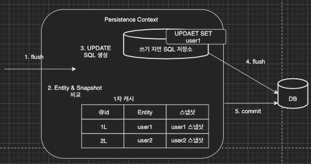

이번 장에서는 [Persistence - 1 (링크)](https://imprint.tistory.com/112?category=1003393)에 이어 영속성에 대해서 알아본다.
번역상으로 Persistence는 "지속됨", "고집"으로 번역되지만 이 글에서는 "Persistence = 영속"이라 정의한다.
글의 하단부에 참고한 강의와 공식문서의 경로를 첨부하였으므로 자세한 사항은 강의나 공식문서에서 확인한다.

---

### 영속성 컨텍스트의 장점

**1차 캐시**

Entity를 생성하고 persist(영속화)하면 영속성 컨텍스트내의 1차 캐시에 저장된다.
```java
// 엔티티를 생성한 상태
User user = new User();
user.setId(1L);
user.setName("유저");

// 엔티티를 영속화
entityManager.persist(user);
```



Entity를 조회하면 DB에 조회하기 전에 1차 캐시를 확인하고 결과가 있으면 캐시의 내용을 응답한다.
```java
// 엔티티를 생성한 상태
User user = new User();
user.setId(1L);
user.setName("유저");

// 엔티티를 영속화
entityManager.persist(user);

// 유저 조회. 1차 캐시에 존재하기 때문에 DB에 쿼리가 날아가지 않고 응답
User storedUser = entityManager.find(User.class, 1L);
```



만약 1차 캐시에 없는 내용을 조회한다면 DB에서 데이터를 조회하고 조회된 내용을 1차 캐시에 저장한다.
이후 1차 캐시에 저장한 내용을 응답한다.



---

**트랜잭션내에서 동일성 보장**

영속성 엔티티에서의 동일성을 보장한다.
데이터베이스의 격리 레벨(Isolation Level)과 무관하게 반복 읽기가 가능한 Repeatable Read 수준의 격리 레벨을 지원한다.

```java
User user1 = entityManager.find(User.class, 1L);
User user2 = entityManager.find(User.class, 1L);

log.info("{}", user1 == user2) // true
```

---

**트랜잭션을 지원하는 쓰기 지연**

Entity Manager는 데이터를 변경하기 위해서 반드시 Transaction 내에서 데이터를 조작해야한다.
이러한 데이터 생성 및 수정을 위한 쿼리는 쓰기 지연 SQL 저장소에 저장되고
Transaction이 Commit되는 시점에 한 번에 DB로 전달된다.

```java
transaction.begin();

entityManager.persist(user1);
entityManager.persist(user2);

transaction.commit();
```

user1이 persist되는 시점에 쓰기 지연 SQL 저장소에 쿼리가 저장되고 1차 캐시에 데이터가 저장된다.



user2가 persist되는 시점에 쓰기 지연 SQL 저장소에 쿼리가 저장되고 1차 캐시에 데이터가 저장된다.



transaction commit()이 호출되는 시점에 쓰기 지연 SQL 저장소에 저장되어 있는 쿼리를 DB로 전달한다.
이후 DB commit을 호출하고 트랜잭션을 종료한다.



---

**변경 감지(Dirty Checking)**

영속성 컨텍스트에는 스냅샷이라는 개념이 존재한다.
1차 캐시에 저장될 때의 상태를 기록하는 시점에서의 스냅샷을 생성하고 flush가 일어날 때 저장된 Entity와 스냅샷과
동일하지 않다면 UPDATE SQL을 만들어서 실행한다.



**플러시(Flush)**

영속성 컨텍스트를 플러시하는 방법은 세가지가 있다.

1. entityManager.flush() 직접호출

2. Transaction Commit 플러시 자동 호출

3. JPQL 쿼리 실행 플러시 자동 호출

```java
entityManager.persist(user1);
entityManager.persist(user2);
entityManager.persist(user3);

JPQL SELECT 쿼리 실행
```

위와 같은 상황에서 만약 JPQL SELECT 쿼리가 실행되었을 때 user1, user2, user3은 조회가 될 것인가.
commit이 발생하지 않았고 DB에 아직 user1, user2, user3이 없기 때문에 조회가 되지 않을 것으로 예상되지만
이러한 문제를 해결하기 위하여 JPA에서 JPQL 쿼리가 실행되기 직전까지의 데이터를 flush시킨다.

플러시는 영속성 컨텍스트를 비우는 행위가 아니라 영속성 컨텍스트와 데이터베이스를 동기화 하는 작업이다.
트랜잭션이라는 작업 단위가 중요하며 커밋 직전에 동기화(flush)를 하면된다.

---

**준영속 상태**

준영속 상태는 영속성 컨텍스트의 관리를 받던 Entity가 Detached되어 나온 상태를 말한다.
당연히 영속성 컨텍스트가 제공하는 기능은 사용하지 못한다.

준영속 상태로 만드는 방법은 아래와 같다.

- entityManager.detach(user1): 특정 Entity만 준영속 상태로 바꾸는 경우

- em.clear(): 영속성 컨텍스트를 완전히 초기화 하는 경우

- em.close(): 영속성 컨텍스트를 종료시키는 경우

---

참고한 강의: https://www.inflearn.com/course/ORM-JPA-Basic

JPA 공식 문서: https://docs.spring.io/spring-data/jpa/docs/current/reference/html/#reference

위키백과: https://ko.wikipedia.org/wiki/%EC%9E%90%EB%B0%94_%ED%8D%BC%EC%8B%9C%EC%8A%A4%ED%84%B4%EC%8A%A4_API