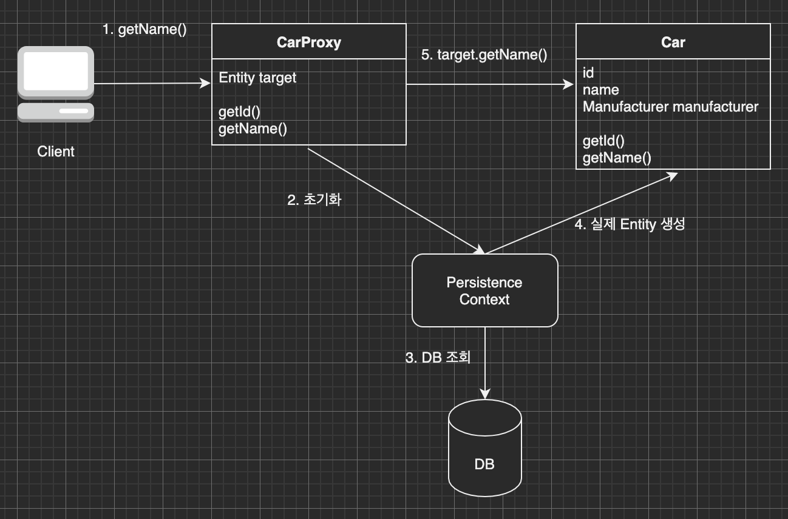

이번 장에서는 즉시 로딩과 지연 로딩을 이해하기 위해 프록시에 대해서 알아본다.
글의 하단부에 참고한 강의와 공식문서의 경로를 첨부하였으므로 자세한 사항은 강의나 공식문서에서 확인한다.

---

### 프록시 서버

프록시를 이해하기 위해 프록시 서버에 대해서 간략하게 알아본다.
아래는 위키백과에 나와있는 프록시 서버의 정의다.


> 프록시 서버(proxy server)는 클라이언트가 자신을 통해서 다른 네트워크 서비스에 간접적으로 접속할 수 있게 해 주는
> 컴퓨터 시스템이나 응용 프로그램을 가리킨다.

간략하게 클라이언트와 서버간의 중개인 역할을 하는 서버를 프록시 서버라고 한다.
프록시란 개념이 서버에 적용되었다고 볼 수 있다.

---

### JPA의 프록시

JPA에서도 사용유무가 불분명한 데이터를 위한 DB조회수 감소와 메모리 사용량을 최적화하기 위해 프록시 객체를 사용한다.
아래와 같이 차량과 차량의 제조사가 있을 때 차량을 조회할 때마다 제조사의 정보가 필요한지 생각해봐야한다.


만약 차량을 조회할 때 제조사의 정보가 필요없고 특히 제조사를 조회할 때 차량의 데이터는 필요없다고 하면
둘을 조회할 때 매번 세트로 조회하게 되면 사용하지도 않을 데이터를 조회하기 위해 복잡한 쿼리와 높은 메모리 사용량이 동반된다.

프록시 객체는 아래의 그림과 같이 개발자가 작성한 실제 클래스를 상속 받아서 만들어지며 겉모습이 동일하다.
이를 사용하는 쪽에서는 진짜 객체인지 프록시 객체인지 구분하지 않고 사용한다. (타입 체크는 제외)


프록시 객체는 실제 객체의 참조 값을 보관하고 있다.
사용하는 쪽에서 프록시 객체의 메소드를 호출하면 프록시 객체는 실제 객체의 메소드를 호출한다.


EntityManager는 객체를 가져올 때 두가지 메서드가 있는데 차이는 아래와 같다.

- find(): 데이터베이스에서 실제 엔티티 객체를 조회한다.
- getReference(): 데이터베이스 조회를 미루고 프록시 엔티티 객체를 조회한다.

아래의 Java 코드처럼 프록시 객체를 조회하고 프록시 객체의 내용을 조회(호출)하면
JPA는 내부적으로 어떻게 동작하는지 살펴본다.

```java
Car storedCar = entityManager.getReference(Car.class, 1L);
storedCar.getName();
```

클라이언트의 요청이 들어오면 프록시 객체는 영속성 컨텍스트의 실제 객체의 초기화를 요청한다.
요청을 받은 영속성 컨텍스트는 DB를 조회하여 실제 Entity 객체를 생성한다.
프록시 객체는 생성된 실제 객체의 메서드를 호출하여 클라이언트의 요청을 처리한다.



### JPA 프록시의 특징

1. 프록시 객체는 처음 사용할 때 한 번만 초기화 된다.
2. 프록시 객체가 초기화 할 때, 프록시 객체가 실제 객체로 바뀌는 것이 아니며 영속성 컨텍스트에 의해 생성된 실제 객체에 접근이 가능해진 것이다.
3. 프록시 객체는 실제 객체를 상속받았으므로 실제 객체를 구현한 클래스가 아니다. 따라서 타입을 확인할 때 ==이 아닌 instance of를 사용해야한다.
4. 영속성 컨텍스트가 이미 실제 객체를 생성했다면 getReference()를 호출하여도 실제 객체가 반환된다.
5. 영속성 컨텍스트의 관리를 받지 않는 상황(준영속)에서 프록시를 초기화하면 LazyInitializationException 상황이 발생한다.

프록시를 확인하는 방법은 아래와 같다.

- PersistenceUnitUtil.isLoaded(): 프록시 인스턴스의 초기화 여부를 확인한다.
- entity.getClass().getName(): 프록시의 클래스를 확인한다.
- org.hibernate.Hibernate.initialize(entity): 프록시를 강제로 초기화한다. JPA 표준에 강제 초기화는 없으므로 속성을 조회하여 초기화하는 방법을 사용해야한다.

---

참고한 강의: https://www.inflearn.com/course/ORM-JPA-Basic

JPA 공식 문서: https://docs.spring.io/spring-data/jpa/docs/current/reference/html/#reference

위키백과: https://ko.wikipedia.org/wiki/%EC%9E%90%EB%B0%94_%ED%8D%BC%EC%8B%9C%EC%8A%A4%ED%84%B4%EC%8A%A4_API