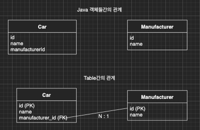
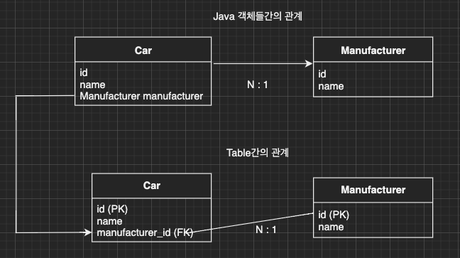
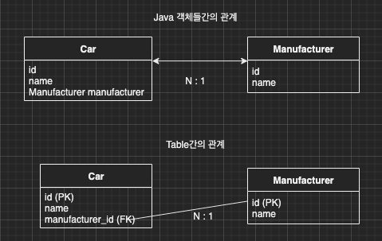

이번 장에서는 기본적인 연관관계 매핑에 대해서 알아본다.
글의 하단부에 참고한 강의와 공식문서의 경로를 첨부하였으므로 자세한 사항은 강의나 공식문서에서 확인한다.

---

### 데이터 중심적인 설계의 문제점

JPA가 없다면 Java 객체(이하 객체)와 DB Table(이하 Table)의 연관관계는 아래의 그림처럼 설계가 된다.



Table은 FK로 연관관계가 맺어져있지만 객체는 연관 관계가 맺어져있지 않고 외래 키를 가지고 있다.
연관관계가 맺어지지 않은 상황에서의 Java Entity 클래스의 코드는 아래와 같을 것이다.

```java
@Entity
public class Car {
    @Id
    @GeneratedValue
    private Long id;
    @Column(name = "name")
    private String name;
    @Column(name = "manufacturer_id")
    private Long manufacturerId;
}
@Entity
public class Manufacturer {
    @Id
    @GeneratedValue
    private Long id;
    @Column(name = "name")
    private String name;
}
```

이러한 방식으로 설계가 되면 개발자가 직접 외래 키를 가지고 핸들링해야한다.
예를 들어 차량과 차량을 만든 제조사를 Insert할 때 Java 객체는 둘간의 연관관계가 맺어져 있지 않기 때문에 직접 두번의 Insert작업을 해주어야한다.
```java
Manufacturer manufacturerA = new Manufacturer();
entityManager.persist(manufacturer);

Car car = new Car();
car.setManufacturerId(manufacturerA.getId());
em.persist(car);
```

조회도 마찬가지로 차량을 먼저 찾아오고 차량이 가지고 있는 제조사의 아이디(manufacturerId)로 제조사를 조회 해야한다.
이렇게 객체를 테이블에 맞추어 데이터 중심적으로 모델링을 하면 객체 지향적인 설계가 불가능해진다.
이러한 문제를 해결해주는 것이 **JPA의 연관관계**다.

---

### 단방향 연관관계

단방향 연관관계를 맺으면 제조사의 아이디를 가지는 대신 제조사 객체 자체를 가지게 된다.



Entity 클래스의 코드도 아래와 같아진다.
@ManyToOne 어노테이션이 추가되었다. 앞에가 자기 자신이라고 생각하면 기억하기 쉽다.
차량 <--> 제조사 관계에서 제조사는 여러대의 차량을 가질 수 있으므로 차량의 입장에서 나는 여러개(Many)고 제조사는 한개(One)가 된다.
@JoinColumn 어노테이션도 추가되었다. 연관관계를 맺을 상대 테이블의 컬럼명이 된다.

```java
@Entity
public class Car {
    @Id
    @GeneratedValue
    private Long id;
    @Column(name = "name")
    private String name;
    @ManyToOne
    @JoinColumn(name = "manufacturer_id")
    private Manufacturer manufacturer;
}
```

이제 객체를 생성하고 데이터를 저장하는 코드도 변경된다. 기존에 외래키를 입력하였지만
이제 Entity 객체를 set하여 저장할 수 있게되어 객체지향적으로 변경된다.

```java
// 제조사 저장
Manufacturer manufacturer = new Manufacturer();
manufacturer.setName("현대")
entityManager.persist(manufacturer);

// 차량 저장
Car car = new Car();
car.setName("쏘나타");
car.setManufacturer(manufacturer);
entityManager.persist(car);
```

그렇다면 조회할 때는 어떻게 변경되었을까?
더 이상 DB에 직접 id를 가지고 찾지 않아도 된다.
우리는 Entity 객체에서 필요한 정보를 찾으면 되고 만약 해당 데이터가 없다면 (Lazy로 설정되어)
필요한 시점에 JPA가 DB에서 조회하여 데이터를 만들어 놓을 것이다.

```java
Car car = entityManager.findById(Car.class, car.getId());

Manufacturer manufacturer = car.getManufacturer();
```

---

### 양방향 연관관계와 연관관계의 주인

단방향 연관관계만으로도 이미 두 Entity의 연관관계 매핑은 완료가 된 것이다.
양방향 연관관계는 최초에 Entity 설계부터 추가할 필요는 없고 개발을 진행하면서 추가하여도 문제가 발생하지 않는다.
단방향 연관관계에서는 차량에서만 제조사를 찾아갈 수 있었지만 양방향 연관관계가 되면 제조사에서도 자신에게 속한 차량을 찾아갈 수 있다.



이러한 관계를 Java 코드로 보면 아래와 같다.
양방향 연관관계에서 추가된 것은 외래 키를 가지고 있는 쪽에서도 반대 쪽을 찾을 수 있도록
@OneToMany가 추가되었다. 여기서 mappedBy은 반대 쪽 Entity의 변수명이다.
제조사(Manufacturer) 입장에서 나는 하나(One)고 나에게 속한 차량은 복수(Many)이므로 @OneToMany가 된다.
당연히 제조사는 복수의 차량을 가지고 있으므로 차량은 컬렉션으로 들어가야한다.

```java
@Entity
public class Car {
    @Id
    @GeneratedValue
    private Long id;
    @Column(name = "name")
    private String name;
    @ManyToOne
    @JoinColumn(name = "manufacturer_id")
    private Manufacturer manufacturer;
}

@Entity
public class Manufacturer {
    @Id
    @GeneratedValue
    private Long id;
    @Column(name = "name")
    private String name;
    @OneToMany(mappedBy = "manufacturer")
    private List<Car> cars = new ArrayList<>();
}
```

연관관계에는 연관관계의 주인이 존재한다.
연관관계의 주인은 외래 키의 위치를 기준으로 정해야한다.
차량과 제조사를 예로 들면 차량이 제조사에 속하면서 제조사가 주인일 것 같지만
제조사 테이블에는 차량 외래 키가 없고 차량 테이블에는 제조사의 외래 키가 있으므로 연관관계의 주인은 차량이 된다.

이렇게 양방향 연관관계가 설정되고 연관관계의 주인이 결정되면 주의해야할 점이 있다.
주인만이 외래 키의 등록 및 수정이 가능하다는 점이다. 주인이 아닌쪽은 읽기만 가능하게 된다. 

예를 들어 아래의 코드와 같이 연관관계의 주인이 아니라 반대 편에 데이터를 입력하면 정상적으로 DB에는 데이터가 들어가지 않는다.
마치 제조사에 차량을 추가하였으므로 DB에 데이터가 입력되어야 할 것 같지만 제조사는 연관관계의 주인이 아니므로 외래 키를 생성할 권한이 없다.

```java
Manufacturer manufacturer = new Manufacturer();
entityManager.persist(manufacturer);

Car car = new Car();

manufacturer.getCars().add(car);

entityManager.persist(car);
```

문제되는 코드를 수정하여 정상적으로 작동하도록 만들면 아래와 같다.
물론 연관관계의 주인의 값만 변경해주면 되지만 양쪽의 값을 전부 입력해주는 것이 좋다.

```java
Manufacturer manufacturer = new Manufacturer();
entityManager.persist(manufacturer);

Car car = new Car();

manufacturer.getCars().add(car);
car.setManufacturer(manufacturer);

entityManager.persist(car);
```

하지만 매번 이렇게 양쪽에 수작업으로 데이터를 세팅해주는 일은 쉽지않다.
사실 쉽지 않다기보다는 실수로 하지 않을 가능성이 높다.
자기 자신을 믿지말고 **연관관계 편의 메소드**를 정의하자.
연관관계 편의 메소드를 적용된 Car Entity를 살펴보면 아래와 같다.

```java
import java.util.Objects;

@Entity
public class Car {
    @Id
    @GeneratedValue
    private Long id;
    @Column(name = "name")
    private String name;
    @ManyToOne
    @JoinColumn(name = "manufacturer_id")
    private Manufacturer manufacturer;

    public void setManufacturer(Manufacturer manufacturer) {
        if (Objects.nonNull(manufacturer)) {
            this.manufacturer.getCars().remove(this);
        } 
        this.manufacturer = manufacturer;
        manufacturer.addCar(this);
    }
}

@Entity
public class Manufacturer {
    @Id
    @GeneratedValue
    private Long id;
    @Column(name = "name")
    private String name;
    @OneToMany(mappedBy = "manufacturer")
    private List<Car> cars = new ArrayList<>();

    public List<Car> getCars() {
        return this.cars;
    }
    public void addCar(Car car) {
        this.cars.add(car);
    }
}
```

차량(Car)에 새로운 제조사(Manufacturer)가 set되는 시점에 set되는 제조사의 차량 목록에도 car가 추가되도록 하였다.
이렇게 수정되는 경우 제조사가 변경되면 기존의 제조사에서는 자기자신(차량)을 제거해줘야하기 때문에 분기문이 하나 추가되었다.
만약 저러한 분기문이 없다면 같은 차량이 여러 제조사에 포함되는 사태가 발생할 것이다.

---

참고한 강의: https://www.inflearn.com/course/ORM-JPA-Basic

JPA 공식 문서: https://docs.spring.io/spring-data/jpa/docs/current/reference/html/#reference

위키백과: https://ko.wikipedia.org/wiki/%EC%9E%90%EB%B0%94_%ED%8D%BC%EC%8B%9C%EC%8A%A4%ED%84%B4%EC%8A%A4_API