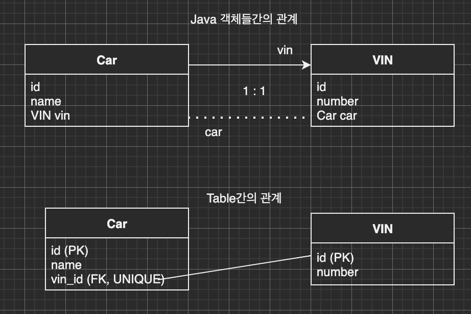

이번 장에서는 [기본적인 연관괸계 매핑 기초 (링크)](https://imprint.tistory.com/115?category=1003393)에 이어 다양한 연관관계 매핑에 대해서 알아본다.
글의 하단부에 참고한 강의와 공식문서의 경로를 첨부하였으므로 자세한 사항은 강의나 공식문서에서 확인한다.

---

**테이블**의 경우 외래 키 하나만으로 양쪽으로 조인이 가능하다. 사실상 방향이라는 개념이 없다.
하지만 **Java 객체**의 경우 참조용 필드가 있는 객체에서만 다른 객체로 참조가 가능하다.
한쪽만 참조하면 단방향이 되고 양쪽 모두 서로를 참조하는 참조용 필드가 있다면 양방향 참조가 된다.

---

### 다대일 (N : 1)

다대일 단방향의 경우 가장 많이 사용되는 연관관계이며 테이블과 객체관의 관계도는 아래와 같다.


다대다 양방향의 경우 객체들이 양쪽을 서로 참조 할 수 있는 연관관계이며 이때 외래 키를 가지고 있는 쪽이 연관관계의 주인이 된다.


---

### 일대다 (1 : N)

일대다(1 : N) 단방향에서는 일(1)이 연관관계의 주인이 된다.
하지만 테이블의 구조는 다대일(N : 1)구조와 변함이 없으며 객체간의 관계만 변경이 된다.
객체와 테이블의 차이로 연관관계의 주인이 아닌 반대편 테이블에서 외래 키를 관리하는 구조가 된다.
외래 키가 반대편 테이블에 있는 구조이기 때문에 연관관계를 관리하기 위해서는 추가로 UPDATE가 필요해진다.
이러한 이유로 @JoinColumn을 꼭 사용해야한다.
위에서 나열한 것과 같이 일대다 단방향 매핑은 여러가지 단점이 존재한다.
특별한 상황이 아니라면 일대다 단방향 매핑보다 다대일 양방향 매핑을 사용하는 것이 좋다.

아래는 일대다 단방향인 경우의 테이블과 객체간의 연관관계다.
객체의 참조가 반대편 테이블의 외래 키를 바라보는 복잡한 구조가 된다.


이러한 구조를 일대다 양방향으로 바꾸면 더 복잡한 구조가 된며 공식적으로 존재하지도 않는다.(구현이 가능할 뿐)
@JoinColumn(insertable = false, updatable = false)로 설정하고 읽기 전용 필드를 사용하여 양방향 처럼 사용해야한다.
그림으로 그려보면 아래와 같다.


일대다 연관관계의 복잡함만 기억하고 다대일 양방향을 사용하는 것이 정신건강상 이롭다.

---

### 일대일 (1 : 1)

일대일 연관관계는 관계를 뒤집어도 일대일 연관관계가 된다.
이러한 경우 외래 키는 메인 테이블과 대상 테이블 어느 쪽에도 존재할 수 있으며
외래 키에 데이터베이스 유니크 제약조건이 추가된다.

일대일 연관관계를 관계도로 그려보면 아래와 같다. (VIN은 차량별로 고유한 차대번호를 의미한다.)


일대일 연관관게의 양방향은 다대일 양방향과 동일하게 외래 키를 가지고 있는 쪽이 주인이 된다.
외래 키를 가지고 있는 메인 테이블이 아닌 반대편 테이블의 객체는 mappedBy를 사용해야한다.



일대일 연관관계는 외래 키가 메인 테이블 또는 대상 테이블 누구나 가질 수 있다.
외래 키의 위치에 따른 특징을 정리하면 아래와 같다.

**메인 테이블에 외래 키가 있는 경우**
메인 객체가 대상 객체의 참조를 가지는 것과 같이 메인 테이블에 외래 키를 두고 대상 테이블을 찾는다.
JPA 매핑이 편리하며 객체지향 개발자들이 선호한다.
메인 테이블만 조회해도 대상 테이블의 데이터가 있는지 확인이 가능하지만 대상 테이블에 값이 없다면
외래 키(메인 객체의 참조 변수)에 null값이 허용된다.

**대상 테이블에 외래 키가 있는 경우**
DBA가 선호하는 방식으로 추후 일대다 관계로 변경되어도 테이블의 구조가 변경되지 않는다.
하지만 JPA 프록시 기능의 한계로 지연로딩이 불가능하여 항상 즉시 로딩된다.

---

### 다대다 (N : M)

다대다 연관관계의 경우 @ManyToMany를 사용하여 간단하게 구현이 가능하다.
하지만 아래의 그림과 같이 여러명의 승객(Rider)을 태울 수 있는 택시(Taxi)와 여러 택시에 승차할 수 있는 승객이 있을 때
DB테이블의 경우 정규화된 테이블 두 개로는 다대다 관계를 표현할 수 없다는 한계점이 있다.


이러한 경우 중간 매핑 테이블을 두어 다대다 연관관계를 구현해야한다. 


또한 매핑 테이블에 여러가지 정보가 포함될 수 있다.
만약 @ManyToMany로 다대다 관계를 구현하였다면 택시 요금, 탑승 일시와 같은 추가정보를 입력할 수 없다.
아래의 그림은 @ManyToMany의 한계점을 매핑용 테이블을 Entity로 승격시켜 @OneToMany와 @ManyToOne으로 극복한 모습이다.


이러한 구조를 Java 코드로 구현하면 아래와 같다.
예제에서는 단순하게 Entity명이 단순 매핑을 의미하는 TaxiRider이지만 실제 서비스에서는 운행내역정도 될 것이다.

```java
@Entity
public class Taxi {
    @OneToMany(mappedBy = "taxi")
    private List<TaxiRider> taxiRiders = new ArrayList<>();
}

@Entity
public class Rider {
    @OneToMany(mappedBy = "rider")
    private List<TaxiRider> taxiRiders = new ArrayList<>();
}

@Entity
public class TaxiRider {
    @ManyToOne
    @JoinColumn(name = "id")
    private Taxi taxi;
    @ManyToOne
    @JoinColumn(name = "id")
    private Rider rider;
}
```

---

### 연관관계 매핑 어노테이션

#### @JoinColumn
외래 키를 매핑할 때 사용하며 주요 속성은 아래와 같다.

- name: 연관관계의 주인이 가지고 있는 외래 키의 이름.
- referencedColumnName: 외래 키가 참조하는 대상 테이블의 컬럼명.(기본값은 대상 테이블의 PK가 된다.)
- foreignKey: 외래 키 제약조건을 직접 지정하며 테이블을 생성할 때만 사용한다.
- unique, nullable, insertable, updatable, columnDefinition, table: @Column의 속성과 동일하다.

---

#### @ManyToOne
다대일 관계를 매핑할 때 사용하며 주요 속성은 아래와 같다.

- optional: 기본 값은 true이며 false로 설정하는 경우 연관된 Entity가 항상 있어야한다.
- fetch: 글로벌 페치 전략(FetchType)을 설정한다.
- cascade: 영속성 전이 기능을 사용한다.
- targetEntity: 연관된 엔티티의 타입정보를 입력한다. 제네릭으로 타입이 추론 가능하므로 사용되지 않는다.

---

#### @OneToMany
다대일 관계 매핑할 때 사용하며 주요 속성은 아래와 같다.

- mappedBy: 연관관계의 주인 필드를 선택한다.
- 이외의 속성은 @ManyToOne과 동일하다.

---

참고한 강의: https://www.inflearn.com/course/ORM-JPA-Basic

JPA 공식 문서: https://docs.spring.io/spring-data/jpa/docs/current/reference/html/#reference

위키백과: https://ko.wikipedia.org/wiki/%EC%9E%90%EB%B0%94_%ED%8D%BC%EC%8B%9C%EC%8A%A4%ED%84%B4%EC%8A%A4_API