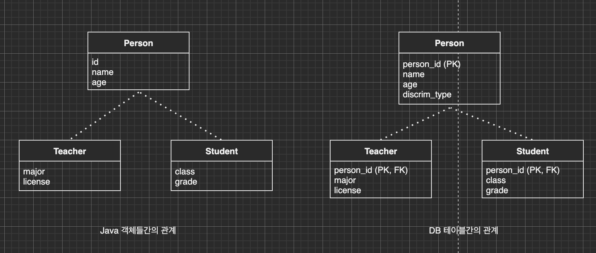
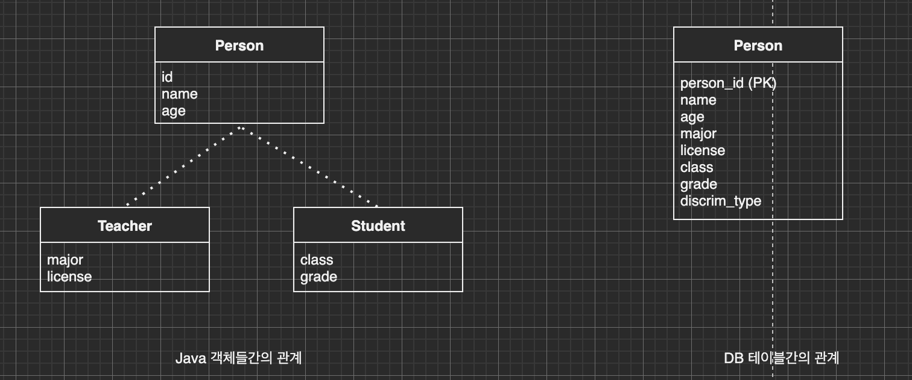
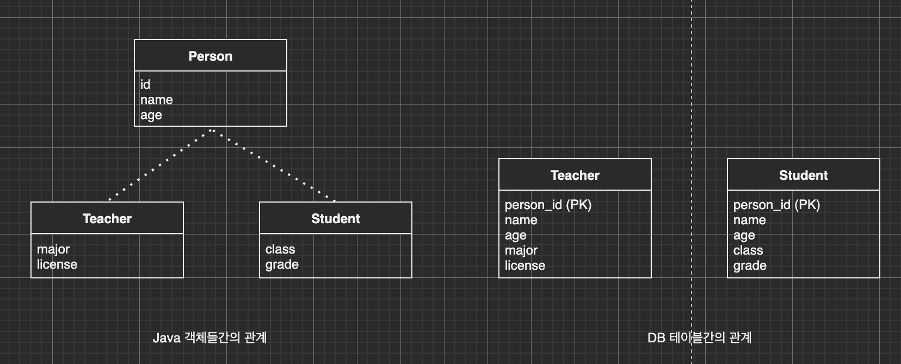
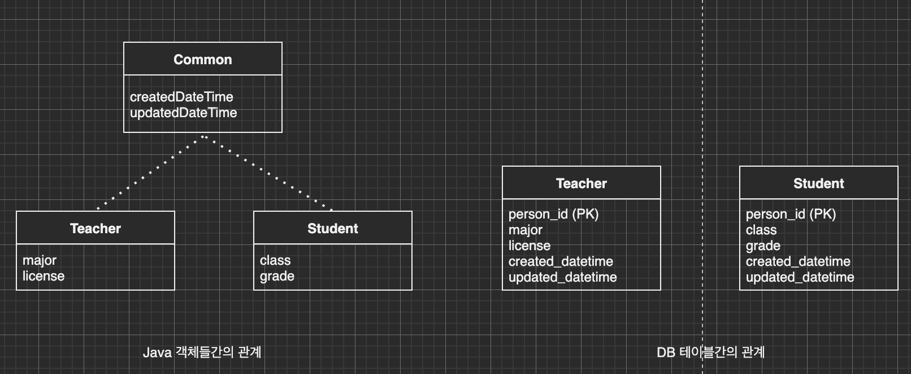

이번 장에서는 [기본적인 연관괸계 매핑 기초 (링크)](https://imprint.tistory.com/115?category=1003393)와 [다양한 연관관계 매핑 (링크)](https://imprint.tistory.com/116?category=1003393)에 이어 상속관계 매핑에 대해서 알아본다.
글의 하단부에 참고한 강의와 공식문서의 경로를 첨부하였으므로 자세한 사항은 강의나 공식문서에서 확인한다.

---

관계형 데이터베이스에는 상속의 개념이 없다.
슈퍼타입과 서브타입 관계라는 모델링이 객체의 상속과 유사하다.
JPA에서 관계형 데이터베이스를 사용해서 상속관계를 매핑하는 방법은 총 세가지가 있다.

상위 클래스인 Person(사람)과 하위 클래스인 Teacher(선생), Student(학생)을 예로 들어 알아본다.

### 조인전략

하위 클래스를 전부 테이블로 만들고 하위 클래스의 테이블들은 부모의 기본 키를 기본 키 및 외래 키로 사용한다.
테이블이 깔끔하게 정규화되고 저장공간을 효율적으로 사용할 수 있다.
다만 조회 시 조인을 많이 사용해야하며 쿼리가 복잡해진다. 또한 데이터를 저장할 때 부모 테이블에 한 번, 자식 테이블에 한 번 총 두 번의 INSERT가 발생한다.



조인 전략을 Entity에 적용시키면 아래와 같다.

```java
@Entity
@Inheritance(strategy = InheritanceType.JOINED)
@DiscriminatorColumn(name = "discrim_type")
public abstract class Person {
    @Id
    @GeneratedValue
    @Column(name = "person_id")
    private Long id;
    private String name;
    private Integer age;
}

@Entity
@DiscriminatorValue("TEACHER")
public class Teacher extends Person {
    private String major;
    private String license;
}

@Entity
@DiscriminatorValue("STUDENT")
public class Student extends Person {
    private String clazz;
    private String grade;
}
```

상위 클래스를 추상 클래스로 선언하고 @Inheritance 속성을 JOINED로 지정한다.
또한 자식을 구분할 컬럼의 이름을 discrim_type으로 지정하였다.
하위 클래스를 보면 Teacher의 DiscriminatorValue는 TEACHER, Student의 DiscrimnatorValue는 STUDENT이다.
데이터가 INSERT될 때 Person클래스의 discrim_type컬럼에 TEACHER 혹은 STUDENT가 들어갈 것이고 어떤 하위 클래스인지 구분하게 된다.

일반적으로 JOINED 전략은 하위 클래스가 상위 클래스의 PK 이름을 그대로 사용하게 되는데
@PrimaryKeyJoinColumn(name = "teacher_id")와 같이 지정하면 상위 클래스와 다른 기본 키 이름을 사용할 수 있게 된다.

---

### 단일 테이블 전략

단일 테이블 전략의 경우 Entity는 나뉘어지지만 데이터는 하나의 테이블에 들어간다.
단일 테이블로 구성되기 때문에 조인이 필요없어 일반적으로 조회 성능이 빠르고 조회 쿼리가 단순하다.
하지만 사용하지 않는 컬럼의 값이 모두 null로 들어가거나 단일 테이블에 모든 데이터가 들어가기 때문에 성능이 오히려 느려질 수도 있다.



이러한 구조를 Entity에 적용시키면 아래와 같다.
JOINED 전략과 거의 동일하며 @Inheritance 어노테이션의 IngeritanceType만 변경되었다.

```java
@Entity
@Inheritance(strategy = InheritanceType.SINGLE_TABLE)
@DiscriminatorColumn(name = "discrim_type")
public abstract class Person {
    ---
}

@Entity
@DiscriminatorValue("TEACHER")
public class Teacher extends Person {
    ---
}

@Entity
@DiscriminatorValue("STUDENT")
public class Student extends Person {
    ---
}
```

---

### 구현 클래스별로 테이블을 생성하는 전략

하위 테이블에 상위 테이블의 모든 데이터를 가지는 전략이다.
하위 클래스별로 따로 처리해야하는 경우나 not null 제약조건을 사용할 수 있다는 점을 제외하면 장점이 없다.
심지어 여러 하위테이블을 조회하기 위해서는 UNION을 사용해야하며 객체 지향적으로 봐도 상속의 개념이 사라진다.
이러한 구현 방법도 있다 정도만 인지하고 사용하지 않도록 한다.



이러한 구조를 Entity에 적용시키면 아래와 같다.
@Inheritance 어노테이션의 IngeritanceType이 TABLE_PER_CLASS 로 변경되었다.
또한 하위 클래스가 각자 다른 테이블로 들어가며 상위 클래스와의 관계도 사라지므로 Discriminator가 필요없다.

```java
@Entity
@Inheritance(strategy = InheritanceType.TABLE_PER_CLASS)
public abstract class Person {
    ---
}

@Entity
public class Teacher extends Person {
    ---
}

@Entity
public class Student extends Person {
    ---
}
```

---

### @MappedSuperclass

정확히는 상속관계의 매핑이 아니다.
상위 추상 클래스는 하위 클래스들의 공통 속성만을 가지고 있다.
예를 들어 데이터 생성일, 수정일, 등록자, 수정자와 같은 동일한 속성을 묶어서 상위 클래스가 가지고 있고
하위 클래스를 위한 테이블이 생성될 때 공통 속성도 같이 생성되기를 바랄때 사용한다.

위에서 살펴본 TABLE_PER_CLASS에서 상속관계가 사라진 개념이라고 생각하면된다.
클래스와 테이블을 살펴보면 아래와 같다.
지금까지 계속 살펴본 상속과는 구분을 해야한다. **공통 속성**만 추상 클래스로 뽑아낸 것이다.



Entity에 적용시키면 아래와 같다.

```java
@MappedSuperclass
public abstract class Common {
    private LocalDateTime createdDateTime;
    private LocalDateTime updatedDateTime;
}

@Entity
public class Teacher extends Common {
    ---
}

@Entity
public class Student extends Common {
    ---
}
```

마지막으로 @Entity 어노테이션이 붙은 Entity 클래스는
Entity 클래스나 @MappedSuperclass 어노테이션이 붙은 클래스만 상속이 가능하다.

---

참고한 강의: https://www.inflearn.com/course/ORM-JPA-Basic

JPA 공식 문서: https://docs.spring.io/spring-data/jpa/docs/current/reference/html/#reference

위키백과: https://ko.wikipedia.org/wiki/%EC%9E%90%EB%B0%94_%ED%8D%BC%EC%8B%9C%EC%8A%A4%ED%84%B4%EC%8A%A4_API