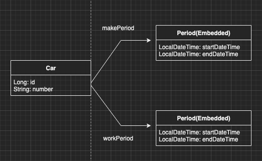
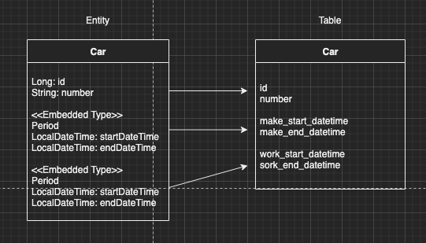

이번 장에서는 JPA의 값타입에 대해서 알아본다.
글의 하단부에 참고한 강의와 공식문서의 경로를 첨부하였으므로 자세한 사항은 강의나 공식문서에서 확인한다.

---

JPA에서 데이터를 분류하는 타입은 크게 엔티티 타입과 값 타입이 있다.
엔티티 타입의 경우 @Entity가 붙은 클래스로 정의되며 데이터가 변해도 식별자(id or sequence)로 추적이 가능하다.
아래와 같은 차량 엔티티가 있는 경우 차량의 번호가 변경되더라도 id는 고유하기 때문에 동일한 엔티티임을 인식할 수 있다.
```java
@Entity
public class Car {
    @Id
    @GeneratedValue
    private Long id;
    @Column("number")
    private String number;
}
```

값 타입은 Integer, String과 같이 값으로만 사용하는 자바의 기본 타입이나 객체다.
엔티티와 다르게 식별자(id or sequence)가 없고 값만 있으므로 값이 변경되면 추적이 불가능하다.

### 값 타입

#### 기본값 타입

자바의 원시 자료형(int, char)과 래퍼(Wrapper) 클래스 Integer, Long 및 String이 있다.
이런 기본값 타입의 생명주기는 엔티티와 동일하다. 엔티티에 속해있는 기본값 타입은 엔티티가 삭제되면 동시에 삭제된다.
이러한 이유로 값 타입은 공유해서는 안된다.

#### 임베디드(Embedded) 타입

자바의 기본 타입들이 아닌 새로운 값 타입을 직접 정의하여 사용할 수 있다.
일반적으로 기본 값 타입을 조합하여 새로운 타입을 생성하기 때문에 복합 값 타입이라고도 한다.

아래와 같이 차량 Entity가 있을 때 임베디드 타입을 적용하는 예시를 들어본다.
```java
@Entity
public class Car {
    @Id
    @GeneratedValue
    private Long id;
    private String number;
    private LocalDateTime makeStartDateTime; // 차량 생산 시작 일자
    private LocalDateTime makeEndDateTime;   // 차량 생산 종료 일자
    private LocalDateTime workStartDateTime; // 차량 사용 시작 일자
    private LocalDateTime workEndDateTime;   // 차량 사용 종료 일자
}
```

차량 엔티티는 차량 번호, 제조 시작 및 종료일시, 차량 사용 시작 및 종료일시가 있다.
여기서 생산일시와 사용일시를 임베디드 타입으로 분류시켜본다.

```java
@Entity
public class Car {
    @Id
    @GeneratedValue
    private Long id;
    private String number;
    @Embedded
    @AttributeOverrides({
            @AttributeOverride(name = "startDateTime", column = @Column(name = "make_start_datetime")),
            @AttributeOverride(name = "endDateTime", column = @Column(name = "make_end_datetime"))
    })
    private Period makePeriod;
    @Embedded
    @AttributeOverrides({
            @AttributeOverride(name = "startDateTime", column = @Column(name = "work_start_datetime")),
            @AttributeOverride(name = "endDateTime", column = @Column(name = "work_end_datetime"))
    })
    private Period workPeriod;
}

@Embeddable
public class Period {
    private LocalDateTime startDateTime;
    private LocalDateTime endDateTime;
}
```



같은 임베디드 타입 사용으로 컬럼명이 중복되기 때문에 @AttributeOverride 어노테이션을 사용하여 재정의하였다.

차량 엔티티에 직접 명시되어 있던 기간 관련 변수들이 Period 임베디드 클래스로 따로 선언이 되었다.
Period로 생성한 Embedded 타입은 기간이 필요한 모든 곳에 재사용될 수 있다.
이번 예시에도 제조기간, 사용기간 두 곳에서 동일한 임베디드 타입을 사용하였다.
Period라는 임베디드 타입에 같은 성향의 값들이 모이면서 높은 응집도를 가지게되었다.
이러한 임베디드 타입 또한 엔티티의 생명주기와 동일한 생명주기를 가진다.

이렇게 일부 값들은 임베디드 타입으로 바꾸더라도 테이블에는 전혀 바뀌지 않는다.
일반적으로 잘 설계된 ORM 어플리케이션의 클래스의 수는 테이블 수보다 많다.



---

#### 값 타입과 불변 객체

기본값 타입을 엔티티간에 공유하면 하나의 엔티티에서 수정하면 다른 엔티티 또한 영향을 받기 때문에 위험하다.
임베디드 타입 또한 같은 타입을 여러 엔티티에서 공유하면 위험하다.
그렇기 때문에 필요한 경우 값을 공유하는 것이 아니라 복사하여 서로 다른 주소 값의 값타입 객체를 바라보게 해야한다.

하지만 임베디드 타입은 자바의 기본 타입이 아니라 객체 타입이라는 한계점이 있다.
객체 타입에 참조 값을 직접 대입하는 것은 자바 문법적으로 막을 수 있는 방법이 없다. 
객체의 공유 참조는 개발자가 실수하지 않기를 바랄뿐 피할 수 없는 문제이다.

다시 한번 차량 엔티티를 살펴본다. (글이 길어져 MakePeriod만 예로 든다.)

```java
@Entity
@Setter
@AllArgsConstructor
public class Car {
    @Id
    @GeneratedValue
    private Long id;
    private String number;
    @Embedded
    private Period makePeriod;
}

@Embeddable
@AllArgsConstructor
public class Period {
    private LocalDateTime startDateTime;
    private LocalDateTime endDateTime;
}
```

이러한 상황에서 아래의 코드처럼 두 엔티티를 생성해본다.
```java
Car carA = new Car();
carA.setMakePeriod(
        LocalDateTime.of(2020, 1, 1, 0, 0, 0),
        LocalDateTime.of(2021, 1, 1, 0, 0, 0));

Car carB = new Car();
carB.setMakePeriod(carA.getMakePeriod());
```

carA는 새로운 생산기간을 만들어서 주입하였고 carB는 carA의 값을 그대로 사용하였다.
하지만 주의해야할 점은 값을 복사한 것이 아니라 Heap상의 주소를 복사한 것이다.
즉, carA의 값이 변경되면 carB의 값도 같이 변경될 것이고 carB의 값이 변경되면 carA의 값도 같이 변경될 것이다.

이러한 공유 참조 문제는 피할 수 없다.
객체 타입을 수정할 수 없도록 하여 부작용을 차단해야한다.
값 타입은 불변 객체로 설계하고 생성자만으로 값을 설정하고 수정자를 만들지 말아야한다.
말로만 설명하면 너무 추상적이므로 부작용이 차단된 차량 엔티티 클래스를 살펴본다.

```java
@Entity
@AllArgsConstructor
public class Car {
    @Id
    @GeneratedValue
    private Long id;
    private String number;
    @Embedded
    private Period makePeriod;
}
```

단순히 Setter 어노테이션만 제거되었다.
하지만 이런 단순한 수정만으로 생산기간의 값은 최초 엔티티가 생성될 때 입력한 값을 절대로 수정 할 수 없는 엔티티가 되었다.

또한 값 타입을 비교할 때는 참조 값이 아닌 인스턴스의 값을 비교해야한다.
그렇기 때문에 동일성(Identity)를 비교해서는 안되고 동등성(equivalence)를 비교해야한다.
이러한 점을 인지하고 있다면 간단하게 @EqualsAndHashCode 어노테이션 붙여서 사용하면 된다.

---

#### 값 타입 컬렉션

값 타입 컬렉션은 하나 이상의 값 타입을 저장할 때 사용하며 @ElementCollection 또는 @CollectionTable과 함께 사용된다.
자바 객체와 다르게 데이터베이스는 컬렉션을 하나의 테이블에 저장할 수 없으므로 컬렉션을 저장하기 위한 별도의 테이블이 필요하다.
값 타입 컬렉션의 경우 변경 사항이 발생하면 주인 엔티티와 연관된 모든 데이터를 삭제하고 값 타입 컬렉션이 있는 현재 값을 모두 다시 저장한다.
실무에서는 상황에 따라 값 타입 컬렉션 대신 일대다 연관관계를 고려해야하며 이렇게 사용하는 경우
Cascade + orphanRemove 조합으로 값 타입 컬렉션처럼 사용해야한다.

---

참고한 강의: https://www.inflearn.com/course/ORM-JPA-Basic

JPA 공식 문서: https://docs.spring.io/spring-data/jpa/docs/current/reference/html/#reference

위키백과: https://ko.wikipedia.org/wiki/%EC%9E%90%EB%B0%94_%ED%8D%BC%EC%8B%9C%EC%8A%A4%ED%84%B4%EC%8A%A4_API