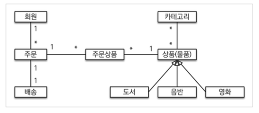
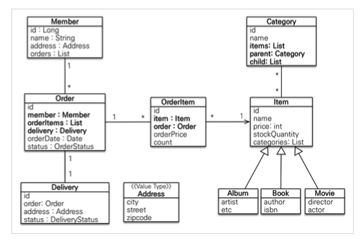
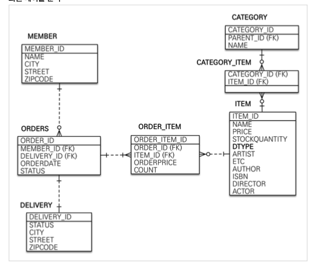

### 도메인 모델과 테이블 설계

**회원, 주문, 상품의 관계:** 회원은 여러 상품을 주문할 수 있다. 그리고 한 번 주문할 때 여러 상품을 선택할 수 있으므로 
주문과 상품은 다대다 관계다. 하지만 이런 다대다 관계는 관계형 데이터베이스는 물론이고 엔티티에서도 거의 사용하지 않는다.
따라서 그림처럼 주문상품이라는 엔티티를 추가해서 다대다 관계를 일대다, 다대일 관계로 풀어냈다.

**상품분류:** 상품은 도서, 음반, 영화로 구분되는데 상품이라는 공통 속성을 사용하므로 상속 구조로 표현했다.

#### Entity 분석

**회원(Member):** 이름과 임베디드 타입인 주소(Address), 그리고 주문(orders) 리스트를 가진다.

**주문(Order):** 한 번 주문시 여러 상품을 주문할 수 있으므로 주문과 주문상품(OrderItem)은 일대다 관계다.
주문은 상품을 주문한 회원과 배송 정보, 주문 날짜, 주문 상태(status)를 가지고 있다. 주문 상태는 열거형을 사용했는데
주문(ORDER), 취소(CANCEL)을 표현할 수 있다.

**주문상품(OrderItem):** 주문한 상품 정보와 주문 금액(orderPrice), 주문 수량(count) 정보를 가지고 있다.
(보통 OrderLine, LineItem으로 많이 표현한다.)

**상품(Item):** 이름, 가격, 재고수량(stockQuantity)을 가지고 있다. 상품을 주문하면 재고수량이 줄어든다.
상품의 종류로는 도서, 음반, 영화가 있는데 각각은 사용하는 속성이 조금씩 다르다.

**배송(Delivery):** 상품과 다대다 관계를 맺는다. parent, child로 부모, 자식 카테고리를 연결한다.

**주소(Address):** 값 타입(임베디드 타입)이다. 회원과 배송(Delivery)에서 사용한다.

회원이 주문을 하기 때문에 회원이 주문리스트를 가지는 것은 얼핏 보면 잘 설계된 것 같지만 객체 세계와 실제 세계는 다르다.
실무에서는 회원이 주문을 참조하지 않고, 주문이 회원을 참조하는 것으로 충분하다. 여기서는 일대다, 다대일 양방향 연관관계를
설명하기 위해서 추가했다.

#### Table 분석

**Member:** 회원 엔티티의 Address 임베디드 타입 정보가 회원 테이블에 그대로 들어갔다. 이것은 Delivery 테이블도 마찬가지다.

**Item:** 앨범, 도서, 영화 타입을 통합해서 하나의 테이블로 만들었다. DTYPE 컬럼으로 타입을 구분한다.

실제 코드에서는 DB에 소문자 + _(언더스코어) 스타일을 사용한다.
데이터베이스 테이블명, 컬럼명에 대한 관례는 회사마다 다르다. 보통은 대문자 + _(언더스코어)나 소문자 + _(언더스코어) 
방식 중에 하나를 지정해서 일관성 있게 사용한다. 강의에서 설명할 때는 객체와 차이를 나타내기 위해 데이터베이스 테이블,
컬럼명은 대문자를 사용했지만 실제 코드에서는 소문자 + _(언더스코어) 스타일을 사용한다.

#### 연관관계 매핑 분석

**회원과 주문:** 일대다, 다대일의 양방향 관계다. 따라서 연관관계의 주인을 정해야 하는데, 외래 키가 있는 주문을
연관관계의 주인으로 정하는 것이 좋다. 그러므로 Order.member를 ORDERS.MEMBER_ID 외래 키와 매핑한다.

**주문상품과 주문:** 다대일 양방향 관계다. 외래 키가 주문상품에 있으므로 주문상품이 연관관계의 주인이다.
그러므로 OrderItem.order를 ORDER_ITEM.ORDER_ID 외래 키와 매핑한다.

**주문상품과 상품:** 다대일 양방향 관계다. Order.delivery를 ORDERS.DELIVERY_ID 외래 키와 매핑한다.

**카테고리와 상품:** @ManyToMany를 사용해서 매핑한다. 실무에서는 @ManyToMany를 사용하지 않지만
여기서는 다대다 관계를 예제로 사용하기 위해서 추가했다.

**외래 키가 있는 곳을 연관관계의 주인으로 정해야한다.**
연관관계의 주인은 단순히 외래 키를 누가 관리하냐의 문제이지 비지니스상 우위에 있다고 주인으로 정하면 안된다.
예를 들어서 자동차와 바퀴가 있으면, 일대다 관계에서 항상 다쪽에 외래 키가 있으므로 외래 키가 있는 바퀴를
연관관계의 주인으로 정하면 된다. 물론 자동차를 연관관계의 주인으로 정하는 것이 불가능한 것은 아니지만,
자동차를 연관관계의 주인으로 정하면 자동차가 관리하지 않는 바퀴 테이블의 외래 키 값이 업데이트 되므로
관리와 유지보수가 어렵고, 추가적으로 별도의 업데이트 쿼리가 발생하는 성능 문제도 있다.

**실무에서는 Setter를 사용하지 말아야한다.**
이론적으로 Getter, Setter 모두 제공하지 않고, 꼭 필요한 별도으ㅢ 메서드를 제공하는게 가장 이상적이다.
하지만 실무에서 엔티티의 데이터는 조회할 일이 너무 많으므로, Getter의 경우 모두 열어두는 것이 편리하다.
Getter는 아무리 호출해도 호출 하는 것만으로 데이터의 변화가 발생하지 않는다. 하지만 Setter는 문제가 다르다.
Setter를 호출하면 데이터가 변한다. Setter를 열어두면 가까운 미래의 엔티티가 어디서 변경되었는지 추적하기 힘들어진다.
엔티티를 변경할 때는 Setter 대신에 변경 지점이 명확하도록 변경을 위한 비지니스 메서드를 별도로 제공해야한다.

엔티티의 식별자는 id를 사용하고 PK 컬럼명은 member_id를 사용했다. 엔티티는 타입(여기서는 Member)이 있으므로
id 필드만으로 쉽게 구분할 수 있다. 테이블은 타입이 없으므로 구분이 어렵다. 그리고 테이블은 관례상 테이블명 + id를
많이 사용한다. 참고로 객체에서 id 대신에 memberId를 사용해도 되며 중요한 것은 일관성이다.

**실무에서는 @ManyToMany를 사용하면 안된다.**
@ManyToMany는 편리한 것 같지만, 중간 테이블(CATEGORY_ITEM)에 컬럼을 추가할 수 없고, 세밀하게 쿼리를 실행하기 어렵다.
때문에 실무에서 사용하기에는 한계가 있다. 중간 엔티티(CategoryItem)를 만들고 @ManyToOne, @OneToMany로 매핑해서 사용해야한다.
정리하면 다대다 매핑을 일대다, 다대일 매핑으로 풀어내서 사용해야한다.

**값 타입은 변경 불가능하게 설계해야 한다.**
@Setter를 제거하고 생성자에서 값을 모두 초기화해서 변경 불가능한 클래스를 만들어야한다.
JPA 스펙상 엔티티나 임베디드 타입(@Embeddable)은 자바 기본 생성자(default constructor)를 public 또는
protected로 설정해야 한다. public이 아닌 protected로 설정하여 객체를 캡슐화 해야한다.
JPA가 이러한 제약을 두는 이유는 JPA 구현 라이브러리가 객체를 생성할 때 리플렉션과 같은 기술을 사용할 수 있도록
지원해야 하기 때문이다.

**컬렉션은 필드에서 바로 초기화 해야한다.**
컬렉션은 필드에서 바로 초기화 해야 null safe하다.
우리가 컬렉션을 지정하더라도 하이버네이트는 내장 컬렉션으로 변경하여 사용한다.
만약 임의로 컬렉션을 잘못 생성하면 하이버네이트 내부 메커니즘에서 문제가 발생할 수 있다.
따라서 필드레벨에서 생성하는 것이 가장 안전하고 코드도 간결해진다.

**테이블, 컬럼명 생성 전략**
스프링 부트에서 하이버네이트 기본 매핑 전략을 번경해서 실제 테이블 필드명은 다르다.
- https://docs.spring.io/spring-boot/docs/2.1.3.RELEASE/reference/htmlsingle/#howto-configure-hibernate-naming-strategy 
- http://docs.jboss.org/hibernate/orm/5.4/userguide/html_single/ Hibernate_User_Guide.html#naming

하이버네이트 기존 구현: 엔티티의 필드명을 그대로 테이블의 컬럼명으로 사용한다.

1. 논리명 생성: 명시적으로 컬럼, 테이블명을 직접 적지 않으면 ImplicitNamingStrategy를 사용한다.
2. 물리명 적용: 모든 논리명에 적용된다. 실제 테이블에 적용된다.

#### 기술 설명

**@Repository:** 스프링 빈으로 등록, JPA 예외를 스프링 기반 예외로 예외 변환
**@PersistenceContext:** 엔티티 매니저(EntityManager) 주입
**@PersistenceUnit:** 엔티티 매니저 팩토리(EntityManagerFactory) 주입
**@Transaction:** 트랜잭션, 영속성 컨텍스트. readOnly = true를 사용하는 경우 데이터의 변경이 없는 읽기 전용 메서드에 사용,
영속성 컨텍스트를 플러시 하지 ㅇ낳으므로 약간의 성능 향상(읽기 전용에는 다 적용), 데이터베이스 드라이버가 지원한다면 DB에서 성능 향상

실무에서는 회원 가입 시 이름 중복검사와 같은 검증 로직이 있더라도 멀티 쓰레드 상황을 고려하여
테이블에 유니크 제약 조건을 추가하는 것이 안전하다.

**@RunWith(SpringRunner.class):** 스프링과 테스트 통합
**@SpringBootTest:** 스프링 부트를 띄우고 테스트
**@Transactional:** 반복 가능한 테스트 지원, 각각의 테스트를 실행할 때마다 트랜잭션을 시작하고
테스트가 끝나면 트랜잭션을 강제로 롤백(테스트 케이스에서 사용하는 경우에만 롤백한다.)

테스트를 진행할 때 src/test/resources 에 설정파일이 있다면 해당 경로의 설정파일을 우선으로 사용한다.
만약 없는 경우 src/main/resources 의 설정파일을 사용한다.

**생성 메서드(createOrder()):** 주문 엔티티를 생성할 때 사용한다. 주문 회원, 배송정보, 주문상품의 정보를 받아서
실제 주문 엔티티를 생성한다.

**주문 취소(cancel()):** 주문 취소 시 사용한다. 주문 상태를 취소로 변경하고 주문상품에 주문 취소를 알린다.
만약 이미 배송을 완료한 상품이면 주문을 취소하지 못하도록 예외를 발생시킨다.

**전체 주문 가격 조회:** 주문 시 사용한 전체 주문 가격을 조회한다. 전체 주문 가격을 알려면 각각의 주문상품 가격을 알아야 한다.
로직을 보면 연관된 주문 상품들의 가격을 조회해서 더한 값을 반환한다. (실무에서는 주로 주문에 전체 주문 가격 필드를 두고 역정규화 한다.)

주문 서비스의 주문과 주문 취소 메서드를 보면 비즈니스 로직 대부분이 엔티티에 있다.
서비스 계층은 단순히 엔티티에 필요한 요청을 위임하는 역할을 한다. 이처럼 엔티티가 비즈니스 로직을 가지고 객체 지향의
특성을 적극 활용하는 것을 도메인 모델 패턴이라 한다. 반대로 엔티티에는 비즈니스 로직이 거의 없고 서비스 계층에서 대부분의
비즈니스 로직을 처리하는 것을 트랜잭션 스크립트 패턴이라 한다.

JPQL 쿼리를 문자로 생성하기는 번거롭고, 실수로 인한 버그가 충분히 발생할 수 있다.
JPA Criteria는 JPA 표준 스펙이지만 실무에서 사용하기에 너무 복잡하다. 결구 다른 대안이 필요하다.
많은 개발자가 비슷한 고민을 했지만, 가장 멋진 해결책은 Querydsl이 제시했다. Querydsl 소개장에서 간단히 언급한다.
