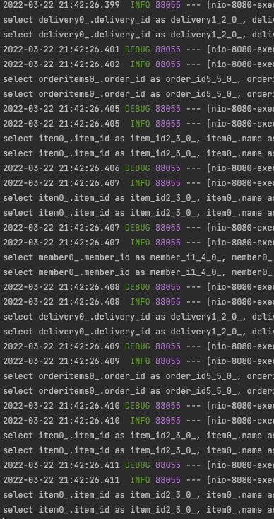
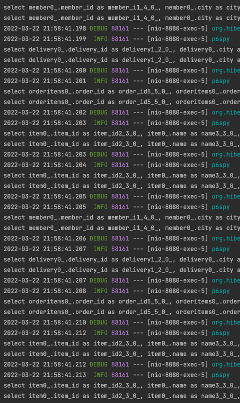

이번 장에서는 [xToOne 성능 최적화 (링크)](https://imprint.tistory.com/127?category=1061011)에 이어 xToMany 연관관계의 최적화에 대해서 알아본다.
글의 하단부에 참고한 강의와 공식문서의 경로를 첨부하였으므로 자세한 사항은 강의나 공식문서에서 확인한다.

---

### Step 1: Response에 Entity를 사용하는 경우

Entity를 그대로 Response의 값으로 사용하는 방법이다.

**OrderCollectionAPIController**

```java
@RestController
@RequiredArgsConstructor
@RequestMapping(value = "/api/orders")
public class OrderCollectionAPIController {

    private final OrderRepository orderRepository;

    @GetMapping(value = "", headers = "X-API-VERSION=1")
    public List<Order> getOrdersV1() {
        List<Order> orders = orderRepository.findAll();
        orders.forEach(i -> {
            i.getMember().getName();
            i.getDelivery().getAddress();
            List<OrderItem> orderItems = i.getOrderItems();
            orderItems.forEach(j -> j.getItem().getName());
        });
        return orders;
    }

}
```

이러한 경우 Json으로 변환하는 과정에서 무한 순환하지 않도록 @JsonIgnore를 추가해야한다.

**Order**

```java
@Entity
@Table(name = "orders")
@Getter @Setter
@NoArgsConstructor(access = PROTECTED)
public class Order {

    // 생략
    @JsonIgnore
    @OneToMany(mappedBy = "order", cascade = ALL)
    private List<OrderItem> orderItems = new ArrayList<>();

    @JsonIgnore
    @OneToOne(fetch = LAZY, cascade = ALL)
    @JoinColumn(name = "delivery_id")
    private Delivery delivery;
    
    // 이하 생략
}
```

이렇게 조회하는 경우 FetchType이 Lazy이기 때문에 추가 쿼리가 발생한다.
또한 xToMany 연관관계에서는 추가 쿼리가 지금까지 알아보았던 1 + N 정도의 수준이 아닌 몇 번의 쿼리가 발생할지 예상조차 할 수 없다.
이하 1 + N + M ...와 같이 몇 번의 쿼리가 발생할지 예상할 수 없는 쿼리를 1 + N...이라 칭한다.



---

### Step 2: Entity를 DTO로 변환하는 경우 (1 + N ...)

이번에는 Entity가 외부로 노출되는 시급한 문제를 해결하기 위해 DTO 클래스를 만들어서 반환한다.
OrderControllectionAPIController의 내부 클래스로 OrderDTO와 OrderItemDTO를 생성하였다.

**OrderDTO & OrderItemDTO**

```java
@Data
@Builder
@AllArgsConstructor
static class OrderDTO {
    private Long orderId;
    private String name;
    private LocalDateTime orderDate;
    private OrderStatus orderStatus;
    private Address address;
    private List<OrderItemDTO> orderItems;
    public static OrderDTO of(Order order) {
        return OrderDTO.builder()
                .orderId(order.getId())
                .name(order.getMember().getName())
                .orderDate(order.getOrderDate())
                .orderStatus(order.getStatus())
                .address(order.getDelivery().getAddress())
                .orderItems(order.getOrderItems().stream().map(OrderItemDTO::of).collect(Collectors.toList()))
                .build();
    }

}

@Data
@Builder
@AllArgsConstructor
static class OrderItemDTO {
    private String itemName;
    private int orderPrice;
    private int count;
    public static OrderItemDTO of(OrderItem orderItem) {
        return OrderItemDTO.builder()
                .itemName(orderItem.getItem().getName())
                .orderPrice(orderItem.getOrderPrice())
                .count(orderItem.getCount())
                .build();
    }
}
```

Controller에서는 Entity를 조회하고 DTO로 변환하여 반환한다.

**OrderCollectionAPIController**

```java
@RestController
@RequiredArgsConstructor
@RequestMapping(value = "/api/orders")
public class OrderCollectionAPIController {

    private final OrderRepository orderRepository;

    @GetMapping(value = "", headers = "X-API-VERSION=2")
    public List<OrderDTO> getOrdersV2() {
        List<Order> orders = orderRepository.findAll();
        return orders.stream()
                .map(OrderDTO::of)
                .collect(Collectors.toList());
    }
}
```

하지만 아직 우리에게 1 + N... 이라는 문제가 남아있다.



---

### Step 3: Entity를 DTO로 변환하는 경우 (Fetch Join를 통한 1 + N ... 해결)

Fetch Join을 사용하면 단 한 번의 쿼리로 원하는 결과를 얻을 수 있다.

**OrderCollectionAPIController**

```java
@RestController
@RequiredArgsConstructor
@RequestMapping(value = "/api/orders")
public class OrderCollectionAPIController {

    private final OrderRepository orderRepository;

    @GetMapping(value = "", headers = "X-API-VERSION=3")
    public List<OrderDTO> getOrdersV3() {
        List<Order> orders = orderRepository.fetchAllByFetchJoin();
        return orders.stream()
                .map(OrderDTO::of)
                .collect(Collectors.toList());
    }
}
```

**OrderRepository**

```java
@Repository
@RequiredArgsConstructor
public class OrderRepository {

    private final EntityManager entityManager;

    public List<Order> fetchAllByFetchJoin() {
        return entityManager.createQuery(
                "SELECT DISTINCT O " +
                        "FROM Order O " +
                        "       JOIN FETCH O.member M " +
                        "       JOIN FETCH O.delivery D " +
                        "       JOIN FETCH O.orderItems OI " +
                        "       JOIN FETCH OI.item I ", Order.class
        ).getResultList();
    }
}
```

Distinct를 사용하여 중복 데이터를 지웠다.
DB의 Distinct는 row가 완벽하게 동일해야 지워지지만 JPA의 Distinct는 엔티티가 동일하면 중복된 엔티티로 판단하고 하나로 줄인다.

하지만 중요한 점은 이미 DB에서 발생한 결과 값은 컬렉션 조인으로 인해 값이 부풀려진 상태이다.
이러한 이유로 컬렉션 조인은 페이징이 불가능하다. 
만약 페이징을 시도하면 DB에서 Limit 제약없이 모든 데이터를 가져와서 어플리케이션 레벨에서 페이징처리가 된다.

---

### Step 4: Entity를 DTO로 변환하는 경우 (Batch Fetch Size를 통한 Paging)

Entity를 DTO로 변환하여 API 스펙과 Entity의 관계를 끊고 Fetch Join을 통하여 1 + N... 쿼리가 발생하는 것을 해결하였다.
하지만 대부분 목록을 조회하는 API는 페이징이 필요하다.
이번에는 Batch Fetch Size 옵션을 통해 페이징이 가능하도록 수정해본다.

application.yml 또는 application.properties 파일에 아래와 같이 옵션을 추가한다.

```yml
spring.jpa.properties.hibernate.default_batch_fetch_size: 1000
```

또는 Entity의 xToMany 연관관계 부분에 @BatchSize 어노테이션을 사용한다.

```java
@Entity
@Table(name = "orders")
@Getter @Setter
@NoArgsConstructor(access = PROTECTED)
public class Order {
    @JsonIgnore
    @BatchSize(size = 1000)
    @OneToMany(mappedBy = "order", cascade = ALL)
    private List<OrderItem> orderItems = new ArrayList<>();
}
```

이제 정상적으로 페이징 처리가 되는지 확인해본다.

**OrderCollectionAPIController**

```java
@RestController
@RequiredArgsConstructor
@RequestMapping(value = "/api/orders")
public class OrderCollectionAPIController {

    private final OrderRepository orderRepository;

    @GetMapping(value = "", headers = "X-API-VERSION=4")
    public List<OrderDTO> getOrdersV4(
            @RequestParam(value = "offset", defaultValue = "0") int offset,
            @RequestParam(value = "limit", defaultValue = "100") int limit
    ) {
        List<Order> orders = orderRepository.findAllByFetchJoinWithPagination(offset, limit);
        return orders.stream()
                .map(OrderDTO::of)
                .collect(Collectors.toList());
    }
}
```
**OrderRepository**

```java
@Repository
@RequiredArgsConstructor
public class OrderRepository {
    
    private final EntityManager entityManager;
    
    public List<Order> findAllByFetchJoinWithPagination(int offset, int limit) {
        return entityManager.createQuery(
                "SELECT O " +
                        "FROM Order O " +
                        "       JOIN FETCH O.member M " +
                        "       JOIN FETCH O.delivery D ", Order.class)
                .setFirstResult(offset)
                .setMaxResults(limit)
                .getResultList();
    }
}
```

발생한 쿼리는 아래와 같다.

최초에 Order을 페이징 처리하여 결과를 가져온다.
```sql
select
    order0_.order_id as order_id1_6_0_,
    member1_.member_id as member_i1_4_1_,
    delivery2_.delivery_id as delivery1_2_2_,
    order0_.delivery_id as delivery4_6_0_,
    order0_.member_id as member_i5_6_0_,
    order0_.order_date as order_da2_6_0_,
    order0_.status as status3_6_0_,
    member1_.city as city2_4_1_,
    member1_.street as street3_4_1_,
    member1_.zipcode as zipcode4_4_1_,
    member1_.name as name5_4_1_,
    delivery2_.city as city2_2_2_,
    delivery2_.street as street3_2_2_,
    delivery2_.zipcode as zipcode4_2_2_,
    delivery2_.status as status5_2_2_ 
from
    orders order0_ 
inner join
    member member1_ 
        on order0_.member_id=member1_.member_id 
inner join
    delivery delivery2_ 
        on order0_.delivery_id=delivery2_.delivery_id limit ?
```

OrderItem 데이터를 채우기 위하여 IN 쿼리를 사용하여 OrderItem을 가져온다.

```sql
select
    orderitems0_.order_id as order_id5_5_1_,
    orderitems0_.order_item_id as order_it1_5_1_,
    orderitems0_.order_item_id as order_it1_5_0_,
    orderitems0_.count as count2_5_0_,
    orderitems0_.item_id as item_id4_5_0_,
    orderitems0_.order_id as order_id5_5_0_,
    orderitems0_.order_price as order_pr3_5_0_ 
from
    order_item orderitems0_ 
where
    orderitems0_.order_id in (
        ?, ?
    )
```

Item 데이터를 채우기 위하여 IN 쿼리를 사용하여 Item을 가져온다.

```sql
select
    item0_.item_id as item_id2_3_0_,
    item0_.name as name3_3_0_,
    item0_.price as price4_3_0_,
    item0_.stock_quantity as stock_qu5_3_0_,
    item0_.artist as artist6_3_0_,
    item0_.etc as etc7_3_0_,
    item0_.author as author8_3_0_,
    item0_.isbn as isbn9_3_0_,
    item0_.actor as actor10_3_0_,
    item0_.director as directo11_3_0_,
    item0_.dtype as dtype1_3_0_ 
from
    item item0_ 
where
    item0_.item_id in (
        ?, ?, ?, ?
    )
```

default_batch_fetch_size의 값은 어플리케이션의 메모리 사용량과는 크게 연관이 없다.
한 번에 몇 개의 row를 조회하던 필요한 데이터를 전부 메모리에 올려야하기 때문이다.
DB의 입장에서는 한 번에 많은 데이터를 메모리에 올리지 않아도 되기 때문에 부하가 줄어든다.
하지만 여러번의 커넥션을 연결해야하고 여러번의 결과를 가져가기 때문에 성능상의 문제가 발생할 수 있다.

대략 500 ~ 1000 정도의 값으로 설정하고 자신의 DB가 부하를 버틸 수 있는지 부하테스트를 진행하여 적절한 값을 찾도록 한다.

---

참고한 강의:

- https://www.inflearn.com/course/%EC%8A%A4%ED%94%84%EB%A7%81%EB%B6%80%ED%8A%B8-JPA-API%EA%B0%9C%EB%B0%9C-%EC%84%B1%EB%8A%A5%EC%B5%9C%EC%A0%81%ED%99%94
- https://www.inflearn.com/course/%EC%8A%A4%ED%94%84%EB%A7%81%EB%B6%80%ED%8A%B8-JPA-%ED%99%9C%EC%9A%A9-1
- https://www.inflearn.com/course/ORM-JPA-Basic

- JPA 공식 문서: https://docs.spring.io/spring-data/jpa/docs/current/reference/html/#reference

- 위키백과: https://ko.wikipedia.org/wiki/%EC%9E%90%EB%B0%94_%ED%8D%BC%EC%8B%9C%EC%8A%A4%ED%84%B4%EC%8A%A4_API