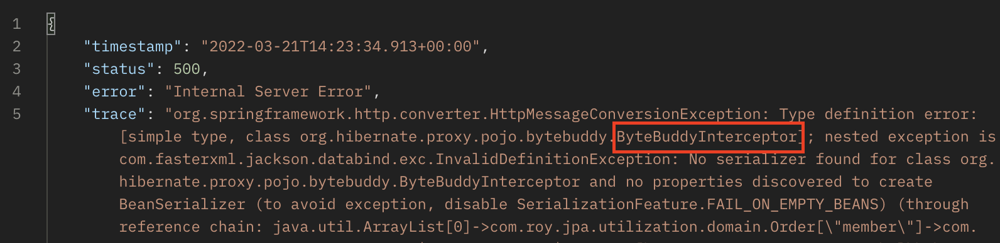
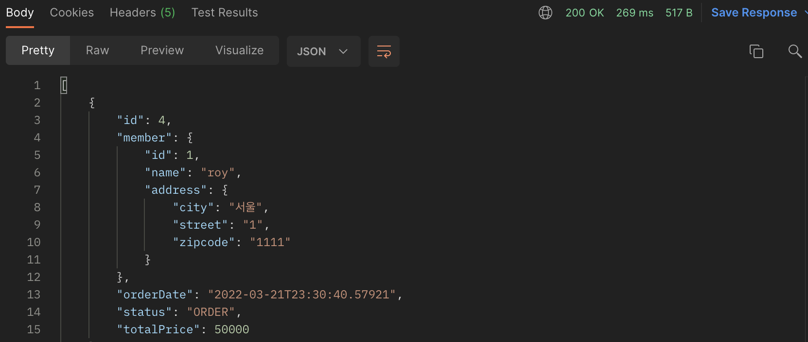
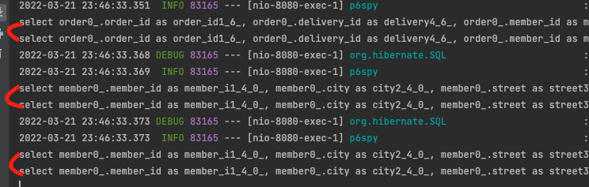

## Optimizing xToOne Relation

이번 장에서는 [Entity 생성 및 갱신 최적화 (링크)](https://imprint.tistory.com/127?category=1061011)에 이어 XToOne 연관관계의 최적화에 대해서 알아본다.
글의 하단부에 참고한 강의와 공식문서의 경로를 첨부하였으므로 자세한 사항은 강의나 공식문서에서 확인한다.

---

### Step 1: Response에 Entity를 사용하는 경우

**OrderAPIController**
```java
@RestController
@RequiredArgsConstructor
@RequestMapping(value = "/api/order")
public class OrderAPIController {

    private final OrderRepository orderRepository;

    @GetMapping(value = "", headers = "X-API-VERSION=1")
    public List<Order> getOrderV1() {
        List<Order> orders = orderRepository.findAllByString(new OrderSearch());
        orders.forEach(i -> {
            i.getMember().getName();
            i.getDelivery().getAddress();
        });
        return orders;
    }

}
```

**Order & Member Entity**
```java
// Annotation 생략
public class Order {
    // 중략 ---
    @ManyToOne(fetch = LAZY)
    @JoinColumn(name = "member_id")
    private Member member;
}
// Annotation 생략
public class Member {
    // 중략 --
    @OneToMany(mappedBy = "member")
    private List<Order> orders = new ArrayList<>();
}
```

이러한 경우 Order를 Response하기 위해 Member를 초기화 시켜야하는데 
Order는 Lazy인 Member를 초기화하고 -> Member는 Lazy인 Order를 초기화시킨다.
결과적으로 Order -> Member -> Order -> Member -> Order -----> 무한 반복하게 된다.

아래처럼 연관 관계의 한쪽에 JsonIgnore 어노테이션을 사용하여 무한 순환참조를 방지해야한다.

**수정된 Member Entity**
```java
// Annotation 생략
public class Member {
    // 중략 --
    @OneToMany(mappedBy = "member")
    private List<Order> orders = new ArrayList<>();
}
```

하지만 이렇게 수정하더라도 Jackson 라이브러리에서 member 프록시 객체를 생성하지 못하여 오류가 발생한다.
ByteBuddy는 Jackson에서 사용하는 프록시 라이브러리이다.



문제를 해결하기 위해 build.gradle에 아래의 라이브러리를 추가한다.

```bash
implementation 'com.fasterxml.jackson.datatype:jackson-datatype-hibernate5'
```

```java
@Bean
Hibernate5Module hibernate5Module() {
    return new Hibernate5Module();
}
```

이제 정상적으로 결과 값을 응답한다.



하지만 이러한 방식은 [Member를 입력하고 수정할 때(링크)](https://imprint.tistory.com/127?category=1061011)와 동일하게 Entity가 노출되어 있다.
발생하는 문제점 또한 동일하며 이번에는 N + 1 문제까지 발생하고 있다.
이러한 N + 1 문제를 해결하기 위하여 FetchType.EAGER로 변경해서는 안된다. (FetchType.LAZY 고정)

---

### Step 2: Response에 DTO를 사용하는 경우 (1 + N)

**OrderAPIController**
```java
@RestController
@RequiredArgsConstructor
@RequestMapping(value = "/api/order")
public class OrderAPIController {

    private final OrderRepository orderRepository;
    
    @GetMapping(value = "", headers = "X-API-VERSION=2")
    public List<Order.OrderResponseDTO> getOrderV2() {
        List<Order> orders = orderRepository.findAll();
        return orders.stream()
                .map(Order.OrderResponseDTO::of)
                .collect(Collectors.toList());
    }

}
```

**Order Entity**
```java
// Annotation 생략
public class Order {
    // 중략 ---
    @Data
    @Builder
    public static class OrderResponseDTO {
        private Long orderId;
        private String name;
        private LocalDateTime orderDate;
        private OrderStatus orderStatus;
        private Address address;
        public static OrderResponseDTO of(Order order) {
            return OrderResponseDTO.builder()
                    .orderId(order.getId())
                    .name(order.getMember().getName())
                    .orderDate(order.getOrderDate())
                    .orderStatus(order.getStatus())
                    .address(order.getMember().getAddress())
                    .build();
        }
    }
}
```

요청에 대한 응답으로 사용할 OrderResponseDTO를 생성하였다.
이렇게 되면 Order Entity와 화면을 위한 프레젠테이션 계층이 분리가 되었다.

하지만 우리에게는 아직 N + 1이라는 문제가 남아있다.



---

### Step 3: Response에 DTO를 사용하는 경우 (Fetch Join)

이번에는 JPA의 Fetch Join을 사용하여 한 번의 쿼리로 원하는 결과를 얻어본다.

**OrderAPIController**

```java
@RestController
@RequiredArgsConstructor
@RequestMapping(value = "/api/order")
public class OrderAPIController {

    private final OrderRepository orderRepository;

    @GetMapping(value = "", headers = "X-API-VERSION=3")
    public List<Order.OrderResponseDTO> getOrderV3() {
        List<Order> orders = orderRepository.findAllByFetchJoin();
        return orders.stream()
                .map(Order.OrderResponseDTO::of)
                .collect(Collectors.toList());
    }
}
```

**OrderRepository**

```java
@Repository
@RequiredArgsConstructor
public class OrderRepository {

    private final EntityManager entityManager;

    public List<Order> findAllByFetchJoin() {
        return entityManager.createQuery(
                "SELECT " +
                        "   O " +
                        "FROM " +
                        "   Order O " +
                        "       JOIN FETCH O.member M " +
                        "       JOIN FETCH O.delivery D ", Order.class
        ).getResultList();
    }
}
```

---

### Step 4: JPQL에서 DTO로 조회하는 경우

일반으로 SQL을 작성하는 것 처럼 원하는 필드만 가져와서 DTO의 생성자에 대입시킨다.
이렇게 Entity가 아닌 DTO를 조회하는 리포지토리와 DTO는 기존의 repository 클래스에 작성하는 것이 아니라 
새로운 디렉토리(queryrepository)를 만들고 생성된 디렉토리에 새로운 리포지토리(OrderQueryRepository)와 DTO 클래스(OrderQueryDTO)를 생성하였다.


이러한 규칙으로 작성하게 되면 Entity를 조회하는 리포지토리와 화면 의존적인 쿼리가 발생하는 Query 리포지토리를 구분할 수 있다.

**OrderAPIController**

```java
@RestController
@RequiredArgsConstructor
@RequestMapping(value = "/api/order")
public class OrderAPIController {

    private final OrderRepository orderRepository;
    private final OrderQueryRepository orderQueryRepository;

    @GetMapping(value = "", headers = "X-API-VERSION=4")
    public List<OrderQueryDTO> getOrderV4() {
        return orderQueryRepository.findOrderQueryDTOs();
    }

}
```

**OrderQueryDTO**

```java
@Data
@AllArgsConstructor
public class OrderQueryDTO {
    private Long orderId;
    private String name;
    private LocalDateTime orderDate;
    private OrderStatus orderStatus;
    private Address address;
}
```

**OrderQueryRepository**

```java
@Repository
@RequiredArgsConstructor
public class OrderQueryRepository {

    private final EntityManager entityManager;

    public List<OrderQueryDTO> findOrderQueryDTOs() {
        return entityManager.createQuery(
                "SELECT new com.roy.jpa.utilization.repository.temp.OrderQueryDTO" +
                        "(O.id, M.name, O.orderDate, O.status, D.address) " +
                        "FROM " +
                        "   Order O " +
                        "       JOIN O.member M " +
                        "       JOIN O.delivery D ", OrderQueryDTO.class)
                .getResultList();
    }

}
```

SELECT에서 필요한 필드만 조회하므로 네트워크 비용을 줄일 수 있다.
개인적인 생각으로 Entity -> DTO를 생성하게 되면 Entity 생성 시 한 번, DTO 생성 시 한 번
메모리를 두 번 사용하게 되는데 비해 DTO로 바로 조회하면 Entity 생성 시 사용되는 메모리 사용량을 줄일 수 있을 것으로 예상된다.

하지만 화면 의존적인 DTO 클래스가 리포지토리에 들어간다는 단점이 존재한다.

---

### Summary

DTO로 조회하게 되면 DTO 클래스 생성, Query 리포지토리 생성 등 부가적인 작업이 필요하다.
Query 리포지토리의 각 쿼리들은 하나의 화면에서만 사용될 가능성이 높아 재사용성이 낮다.
하지만 Entity를 조회하는 경우 같은 조건으로 조회하는 API에서는 재사용이 가능하다.

1. Entity를 DTO로 변환하는 방법으로 구현한다.
2. N + 1 문제가 발생하면 Fetch Join을 사용하여 문제를 해결한다.
3. Entity로 조회하는 경우 너무 많은 메모리 또는 네트워크 비용이 발생한다면 DTO로 직접 조회하는 방법을 사용한다.
4. 이러한 방법으로도 성능 개선이 되지 않는 경우에는 Native Query를 사용하여 문제를 해결한다.

---

참고한 강의:

- https://www.inflearn.com/course/%EC%8A%A4%ED%94%84%EB%A7%81%EB%B6%80%ED%8A%B8-JPA-API%EA%B0%9C%EB%B0%9C-%EC%84%B1%EB%8A%A5%EC%B5%9C%EC%A0%81%ED%99%94
- https://www.inflearn.com/course/%EC%8A%A4%ED%94%84%EB%A7%81%EB%B6%80%ED%8A%B8-JPA-%ED%99%9C%EC%9A%A9-1
- https://www.inflearn.com/course/ORM-JPA-Basic

- JPA 공식 문서: https://docs.spring.io/spring-data/jpa/docs/current/reference/html/#reference

- 위키백과: https://ko.wikipedia.org/wiki/%EC%9E%90%EB%B0%94_%ED%8D%BC%EC%8B%9C%EC%8A%A4%ED%84%B4%EC%8A%A4_API