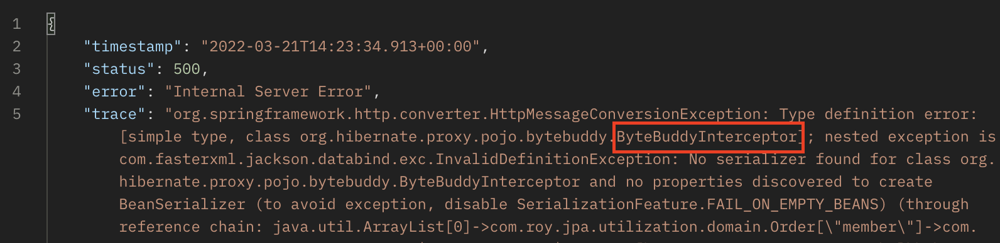
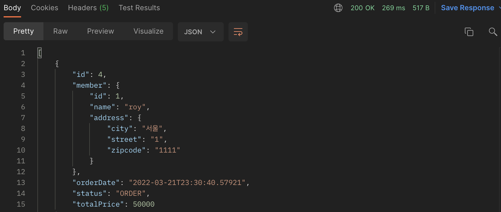

## Optimizing xToOne Relation

이번 장에서는 [Entity 생성 및 갱신 최적화 (링크)](https://imprint.tistory.com/127?category=1061011)에 이어 XToOne 연관관계의 최적화에 대해서 알아본다.
글의 하단부에 참고한 강의와 공식문서의 경로를 첨부하였으므로 자세한 사항은 강의나 공식문서에서 확인한다.

---

### Step 1: Response에 Entity를 사용하는 경우

**OrderAPIController**
```java
@RestController
@RequiredArgsConstructor
@RequestMapping(value = "/api/order")
public class OrderAPIController {

    private final OrderRepository orderRepository;

    @GetMapping(value = "", headers = "X-API-VERSION=1")
    public List<Order> getOrderV1() {
        List<Order> orders = orderRepository.findAllByString(new OrderSearch());
        orders.forEach(i -> {
            i.getMember().getName();
            i.getDelivery().getAddress();
        });
        return orders;
    }

}
```

**Order & Member Entity**
```java
// Annotation 생략
public class Order {
    // 중략 ---
    @ManyToOne(fetch = LAZY)
    @JoinColumn(name = "member_id")
    private Member member;
}
// Annotation 생략
public class Member {
    // 중략 --
    @OneToMany(mappedBy = "member")
    private List<Order> orders = new ArrayList<>();
}
```

이러한 경우 Order를 Response하기 위해 Member를 초기화 시켜야하는데 
Order는 Lazy인 Member를 초기화하고 -> Member는 Lazy인 Order를 초기화시킨다.
결과적으로 Order -> Member -> Order -> Member -> Order -----> 무한 반복하게 된다.

아래처럼 연관 관계의 한쪽에 JsonIgnore 어노테이션을 사용하여 무한 순환참조를 방지해야한다.

**수정된 Member Entity**
```java
// Annotation 생략
public class Member {
    // 중략 --
    @OneToMany(mappedBy = "member")
    private List<Order> orders = new ArrayList<>();
}
```

하지만 이렇게 수정하더라도 Jackson 라이브러리에서 member 프록시 객체를 생성하지 못하여 오류가 발생한다.
ByteBuddy는 Jackson에서 사용하는 프록시 라이브러리이다.



문제를 해결하기 위해 build.gradle에 아래의 라이브러리를 추가한다.

```bash
implementation 'com.fasterxml.jackson.datatype:jackson-datatype-hibernate5'
```

```java
@Bean
Hibernate5Module hibernate5Module() {
    return new Hibernate5Module();
}
```

이제 정상적으로 결과 값을 응답한다.



하지만 이러한 방식은 [Member를 입력하고 수정할 때(링크)](https://imprint.tistory.com/127?category=1061011)와 동일하게 Entity가 노출되어 있다.
발생하는 문제점 또한 동일하며 이번에는 N + 1 문제까지 발생하고 있다.
이러한 N + 1 문제를 해결하기 위하여 FetchType.EAGER로 변경해서는 안된다. (FetchType.LAZY 고정)

---

### Step 2: Response에 DTO를 사용하는 경우 (1 + N)


---

### Step 3: Response에 DTO를 사용하는 경우 (Fetch Join)


---

### Step 4: JPQL에서 DTO로 조회하는 경우


---

참고한 강의:

- https://www.inflearn.com/course/%EC%8A%A4%ED%94%84%EB%A7%81%EB%B6%80%ED%8A%B8-JPA-API%EA%B0%9C%EB%B0%9C-%EC%84%B1%EB%8A%A5%EC%B5%9C%EC%A0%81%ED%99%94
- https://www.inflearn.com/course/%EC%8A%A4%ED%94%84%EB%A7%81%EB%B6%80%ED%8A%B8-JPA-%ED%99%9C%EC%9A%A9-1
- https://www.inflearn.com/course/ORM-JPA-Basic

- JPA 공식 문서: https://docs.spring.io/spring-data/jpa/docs/current/reference/html/#reference

위키백과: https://ko.wikipedia.org/wiki/%EC%9E%90%EB%B0%94_%ED%8D%BC%EC%8B%9C%EC%8A%A4%ED%84%B4%EC%8A%A4_API