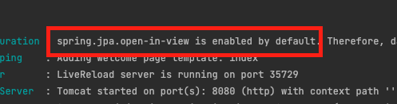
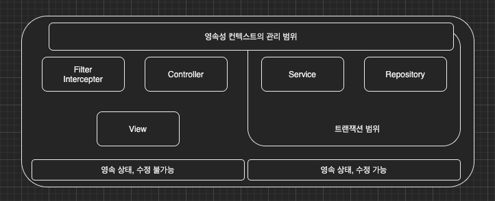
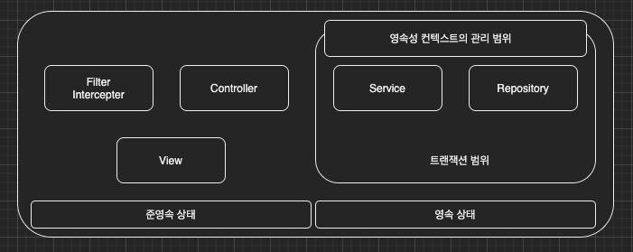

이번 장에서는 JPA의 OSIV에 대해서 알아본다.
글의 하단부에 참고한 강의와 공식문서의 경로를 첨부하였으므로 자세한 사항은 강의나 공식문서에서 확인한다.

---

OSIV는 하이버네이트의 Open Session In View의 줄임말이다.
같은 의미를 가지는 JPA의 Open EntityManager In View라는 표현이 있지만 
일반적으로 OSIV라고 불리며 Spring에서는 둘을 모두 포괄하는 의미에서 Open In View라고 한다.

---

### OSIV 활성화 

OSIV는 기본적으로 활성화 되어있다.
이러한 이유로 Spring 프로젝트를 실행할 때 아래의 이미지와 같이 open-in-view is enabled by default라는 WARN 메시지가 뜨게된다.
Spring에서 INFO 메시지가 아닌 WARN 메시지를 띄우는 것으로 보아 성능상에 문제가 발생할 수 있음을 예측할 수 있다.

open-in-view가 활성화 되어 있는 경우 영속성 컨텍스트가 관리하는 범위가 화면을 위한 Controller와 View까지 확장된다.
이러한 이유로 Controller나 View에서도 지연 로딩이 가능해진다.
물론 트랜잭션 범위를 벗어나면 수정하여도 DB에 반영되지 않는다.

이렇게 Controller와 View에서도 지연 로딩이 가능하기 위해서는 영속성 컨텍스트가 계속 살아있어야하고 
이것은 DB Connection을 계속 사용하고 있음을 의미한다.
즉 DB Connection이 많이 소비될 것을 예상할 수 있다.

---

### OSIV 비활성화

OSIV를 비활성화 하면 View와 Controller의 Entity는 비영속 또는 준영속 상태가 된다.
즉 지연 로딩이 불가능해지기 때문에 Entity를 조작하거나 조회하는 행위는 트랜잭션 범위 내에서 이루어져야 한다.

하지만 트랜잭션 범위를 벗어나자마자 DB Connection을 반납하기 때문에 OSIV 활성화 상태보다 DB Connection을 효율적으로 운영할 수 있다.
DB Connection을 효율적으로 운영할 수 있다는 점에서 우리는 OSIV가 비활성화된 상태에서 개발하는 습관을 들여야한다.

**[커맨드와 쿼리 분리 (링크)](https://en.wikipedia.org/wiki/Command%E2%80%93query_separation)**
일반적으로 핵심 비즈니스 로직이 있는 일반 **Service**와 화면을 위해 성능 최적화가 필요한 **QueryService**를 나누어 개발해야한다.
일반 Service는 비즈니스 로직을 처리하기 위한 로직을 담고 있으며
QueryService는 화면이나 API에 맞춘 로직을 가지고 있으며 비즈니스 로직에 큰 영향을 주지 않는다.

---

참고한 강의:

- https://www.inflearn.com/course/%EC%8A%A4%ED%94%84%EB%A7%81%EB%B6%80%ED%8A%B8-JPA-API%EA%B0%9C%EB%B0%9C-%EC%84%B1%EB%8A%A5%EC%B5%9C%EC%A0%81%ED%99%94
- https://www.inflearn.com/course/%EC%8A%A4%ED%94%84%EB%A7%81%EB%B6%80%ED%8A%B8-JPA-%ED%99%9C%EC%9A%A9-1
- https://www.inflearn.com/course/ORM-JPA-Basic

- JPA 공식 문서: https://docs.spring.io/spring-data/jpa/docs/current/reference/html/#reference

- 위키백과: https://ko.wikipedia.org/wiki/%EC%9E%90%EB%B0%94_%ED%8D%BC%EC%8B%9C%EC%8A%A4%ED%84%B4%EC%8A%A4_API